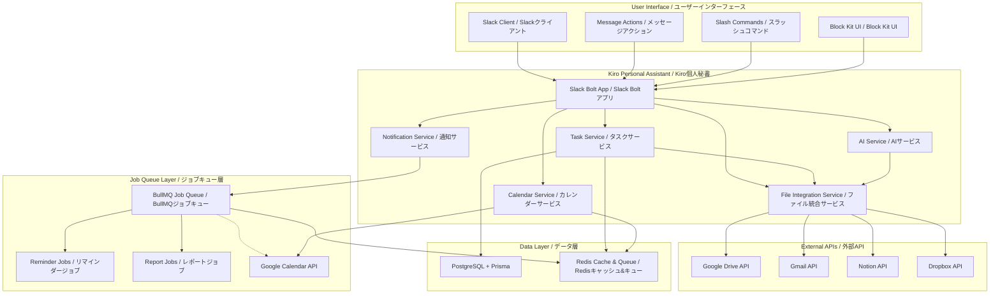

# Design Document / 設計書

## Overview / 概要

This document outlines the system design for the Slack Personal Assistant AI, focusing on enabling users to concentrate on their core work by eliminating friction in task management, scheduling, and communication workflows.

このドキュメントは、タスク管理、スケジューリング、コミュニケーションワークフローの摩擦を排除し、ユーザーが核となる作業に集中できるようにするSlack個人秘書AIのシステム設計を概説します。

## Architecture / アーキテクチャ

### System Architecture Overview / システムアーキテクチャ概要

**Legend / 凡例**: Solid lines = Synchronous calls / 実線 = 同期呼び出し, Dotted lines = Asynchronous processing / 点線 = 非同期処理



### Value-Driven Component Mapping / 価値駆動コンポーネントマッピング

| Core Value / 核心価値 | Primary Components / 主要コンポーネント | Supporting Services / 支援サービス |
|---|---|---|
| **"探さない・思い出さない"** | Task Service, File Integration Service | AI Service (summarization), Redis Cache |
| **"考える前に提示"** | Notification Service, Job Queue (Reminder Jobs) | Calendar Service, AI Service (prediction) |
| **"日程調整の摩擦ゼロ"** | Calendar Service, Message Action Handler | FreeBusy API, Block Kit Renderer |
| **"チャット＝秘書室"** | Mention Handler, Quick Reply Engine | AI Service (style learning), Inbox Manager |
| **"集中を守る"** | Focus Mode Manager, Notification Batcher | Context Analyzer, Priority Engine |

## Components and Interfaces / コンポーネントとインターフェース

### 1. Task Management System / タスク管理システム
**Value Alignment: "探さない・思い出さない" + "考える前に提示"**

```typescript
interface TaskService {
  // Daily Top 5 Display / 日次Top5表示
  getDailyTop5Tasks(userId: string): Promise<TaskCard[]>
  
  // Mention Inbox Processing / メンションインボックス処理
  processMention(mention: SlackMention): Promise<InboxEntry>
  
  // 3-Tier Hierarchy Management / 3階層管理
  suggestHierarchy(task: Task): Promise<HierarchySuggestion>
  
  // AI Reply Generation / AI返信生成
  generateQuickReplies(context: MessageContext, userStyle: UserStyle): Promise<string[]>
  
  // Task Completion Handler / タスク完了ハンドラー
  onTaskCompleted(taskId: string): Promise<void>
  onTaskSnoozed(taskId: string): Promise<void>
}

interface FileIntegrationService {
  // Multi-platform File Search / マルチプラットフォームファイル検索
  searchRecentFiles(query: string, timeRange: TimeRange, platforms: Platform[]): Promise<FileResult[]>
  
  // Document Summarization / 文書要約
  summarizeDocuments(files: FileResult[]): Promise<DocumentSummary>
  
  // Folder URL Detection / フォルダURL検出
  detectFolderUrls(text: string): Promise<FolderUrl[]>
  
  // Rate Limit Management / レート制限管理
  executeWithRateLimit(
    apiCall: () => Promise<any>, 
    provider: string, 
    options?: { maxRetries: 3, backoffMs: 2000 }  // Default: 3 retries, 2^n second backoff
  ): Promise<any>
}

interface TaskCard {
  id: string
  title: string
  priority: 'P1' | 'P2' | 'P3'
  badges: ('🔥' | '⚡' | '⚠️')[]
  dueDate?: Date
  folderUrls: FolderUrl[]
  actions: TaskAction[]
}
```

### 2. Calendar Integration System / カレンダー統合システム
**Value Alignment: "日程調整の摩擦ゼロ"**

```typescript
interface CalendarService {
  // Message to Calendar Candidates / メッセージからカレンダー候補
  extractDateTimeCandidates(message: string): Promise<DateTimeCandidate[]>
  
  // FreeBusy Status Check / FreeBusy状況確認
  checkAvailability(candidates: DateTimeCandidate[], options: FreeBusyOptions): Promise<AvailabilityStatus[]>
  
  // Tentative Booking Management / 仮予定管理
  createTentativeEvents(candidates: DateTimeCandidate[]): Promise<TentativeEvent[]>
  
  // Week View URL Generation / 週ビューURL生成
  generateWeekViewUrl(date: Date): string
}

interface FreeBusyOptions {
  // Calendar Selection Strategy / カレンダー選択戦略
  includePrimary: boolean      // Primary calendar
  includeSelected: boolean     // User-selected calendars
  excludeDeclined: boolean     // Exclude declined events
}

### 4. Job Queue System / ジョブキューシステム
**Value Alignment: "考える前に提示"**

```typescript
interface JobQueueService {
  // Reminder Job Scheduling / リマインダージョブスケジューリング
  scheduleReminder(taskId: string, reminderTime: Date): Promise<JobId>
  
  // Daily Report Generation / 日次レポート生成
  scheduleDailyReport(userId: string, time: string): Promise<JobId>
  
  // Weekly Report Generation / 週次レポート生成
  scheduleWeeklyReport(userId: string, dayOfWeek: number, time: string): Promise<JobId>
  
  // Job Cancellation / ジョブキャンセル
  cancelJob(jobId: JobId): Promise<boolean>
  cancelReminderByTask(taskId: string): Promise<boolean>
}

interface NotificationService {
  // Reminder Management / リマインダー管理
  scheduleTaskReminder(task: Task): Promise<void>
  cancelReminder(taskId: string): Promise<boolean>  // Called on task completion/snooze
  
  // Focus Mode / 集中モード
  enableFocusMode(userId: string, duration: number): Promise<void>
  batchNotifications(userId: string): Promise<NotificationBatch>
}

interface DateTimeCandidate {
  startTime: Date
  endTime: Date
  status: 'free' | 'busy'
  indicators: ('✈️' | '🚶' | '⚠️')[]
  confidence: number
}
```

### 5. AI-Powered Intelligence Layer / AI駆動知能層
**Value Alignment: "考える前に提示" + "集中を守る"**

```typescript
interface AIService {
  // Priority Score Calculation / 優先度スコア計算
  calculatePriorityScore(task: Task, context: UserContext): Promise<number>
  
  // Document Summarization / 文書要約
  summarizeRecentDocuments(query: string, timeRange: TimeRange): Promise<DocumentSummary>
  
  // User Writing Style Learning / ユーザー文体学習
  learnWritingStyle(messages: SlackMessage[]): Promise<UserStyle>
  
  // Context-Aware Response / コンテキスト認識応答
  adaptResponseToContext(message: string, userState: UserState): Promise<string>
}

interface DocumentSummary {
  projectName: string
  background: string
  participants: string[]
  keyIssues: string[]
  relevantFiles: FileReference[]
}
```

## Data Models / データモデル

### Core Entities / 核心エンティティ

```prisma
model User {
  id          String   @id @default(cuid())
  slackUserId String   @unique
  timezone    String   @default("UTC")
  language    String   @default("ja")
  preferences Json     @default("{}")
  
  tasks       Task[]
  inboxItems  InboxItem[]
  focusSessions FocusSession[]
  
  createdAt   DateTime @default(now())
  updatedAt   DateTime @updatedAt
}

model Task {
  id            String    @id @default(cuid())
  title         String
  description   String?
  status        TaskStatus @default(PENDING)
  priority      Priority   @default(P2)
  priorityScore Float      @default(0)
  
  // 3-Tier Hierarchy / 3階層
  level         TaskLevel  @default(SUB_TASK)
  parentId      String?
  parent        Task?      @relation("TaskHierarchy", fields: [parentId], references: [id])
  children      Task[]     @relation("TaskHierarchy")
  
  // Folder Integration / フォルダ統合
  folderUrls    Json       @default("[]")
  
  // Scheduling / スケジューリング
  dueDate       DateTime?
  reminderSent  Boolean    @default(false)
  
  userId        String
  user          User       @relation(fields: [userId], references: [id])
  
  createdAt     DateTime   @default(now())
  updatedAt     DateTime   @updatedAt
}

model InboxItem {
  id          String      @id @default(cuid())
  slackTs     String      @unique
  channelId   String
  messageText String
  status      InboxStatus @default(PENDING)
  
  // Auto-cleanup / 自動クリーンアップ
  expiresAt   DateTime
  
  userId      String
  user        User        @relation(fields: [userId], references: [id])
  
  createdAt   DateTime    @default(now())
  updatedAt   DateTime    @updatedAt
}

model CalendarEvent {
  id          String   @id @default(cuid())
  googleId    String?  @unique
  title       String
  startTime   DateTime
  endTime     DateTime
  status      EventStatus @default(TENTATIVE)
  
  // Tentative Naming / 仮予定命名
  sequenceNumber Int?
  totalInGroup   Int?
  
  userId      String
  
  createdAt   DateTime @default(now())
  updatedAt   DateTime @updatedAt
}

model OAuthToken {
  id           String    @id @default(cuid())
  provider     Provider
  accessToken  String
  refreshToken String?
  expiresAt    DateTime?
  scope        String[]
  
  userId       String
  user         User      @relation(fields: [userId], references: [id])
  
  createdAt    DateTime  @default(now())
  updatedAt    DateTime  @updatedAt
  
  @@unique([userId, provider])
}

model JobQueue {
  id          String    @id @default(cuid())
  jobType     JobType
  payload     Json
  scheduledAt DateTime
  status      JobStatus @default(PENDING)
  attempts    Int       @default(0)
  maxAttempts Int       @default(3)
  
  userId      String?
  
  createdAt   DateTime  @default(now())
  updatedAt   DateTime  @updatedAt
}

enum TaskStatus {
  PENDING
  IN_PROGRESS
  COMPLETED
  CANCELLED
}

enum Priority {
  P1
  P2
  P3
}

enum TaskLevel {
  PROJECT
  MID_TASK
  SUB_TASK
}

enum InboxStatus {
  PENDING
  CONVERTED_TO_TASK
  IGNORED
  QUICK_REPLIED
}

enum EventStatus {
  TENTATIVE
  CONFIRMED
  CANCELLED
}

enum Provider {
  GOOGLE_CALENDAR
  GOOGLE_DRIVE
  GMAIL
  NOTION
  DROPBOX
}

enum JobType {
  REMINDER
  DAILY_REPORT
  WEEKLY_REPORT
  FILE_SUMMARY
}

enum JobStatus {
  PENDING
  PROCESSING
  COMPLETED
  FAILED
  CANCELLED
}
```

## Error Handling / エラーハンドリング

### Graceful Degradation Strategy / 段階的劣化戦略

```typescript
interface ErrorHandlingStrategy {
  // API Failures / API障害
  handleGoogleAPIFailure(error: GoogleAPIError): Promise<FallbackResponse>
  
  // Processing Timeouts / 処理タイムアウト
  handleLongRunningProcess(processId: string): Promise<ProgressUpdate>
  
  // User-Friendly Error Messages / ユーザーフレンドリーなエラーメッセージ
  formatErrorForUser(error: SystemError, language: 'ja' | 'en'): string
}

// Progress Indication for Long Operations / 長時間処理の進捗表示
interface ProgressUpdate {
  message: string
  estimatedTimeRemaining: number
  currentStep: string
  totalSteps: number
}
```

## Testing Strategy / テスト戦略

### Test Coverage Requirements / テストカバレッジ要件

- **Unit Tests**: ≥80% coverage for core business logic
- **Integration Tests**: All external API interactions
- **E2E Tests**: Critical user workflows (task creation, calendar integration)
- **Performance Tests**: Response time targets (≤3s basic, ≤30s complex)
- **AI Quality Tests**: 
  - Document summarization BLEU score ≥ 0.3
  - Content toxicity score ≤ 0.1 (Perspective API)
  - Reply generation relevance score ≥ 0.8

### Key Test Scenarios / 主要テストシナリオ

1. **Daily Top 5 Display**: Morning 7:30 trigger and /todo today command
2. **Calendar Integration**: Message action → candidate list → week view → reply draft
3. **Mention Processing**: Auto-inbox → 3-button interface → task creation
4. **Reminder System**: P1 task reminders at specified times
5. **Multi-language Support**: Japanese ↔ English switching

## Security Considerations / セキュリティ考慮事項

### Data Protection / データ保護

- **Encryption at Rest**: All user data encrypted in PostgreSQL
- **Encryption in Transit**: TLS 1.3 for all API communications
- **OAuth Delegation**: User-authorized access to external services
- **Minimal Permissions**: Least privilege principle for all integrations

### Privacy Compliance / プライバシー準拠

- **Data Retention**: Configurable retention periods for different data types
- **User Consent**: Clear consent flow for AI learning from user messages
- **Data Portability**: Export functionality for user data
- **Right to Deletion**: Complete data removal on user request

## Observability / 可観測性

### Logging Strategy / ログ戦略
- **Framework**: Winston → Loki (JSON structured logging)
- **Log Levels**: info and above in production, debug in development
- **Structured Format**: Include userId, requestId, service, timestamp, and context
- **Privacy**: No sensitive data (tokens, personal info) in logs

### Metrics and Monitoring / メトリクスと監視
- **Collection**: Prometheus metrics with Grafana dashboards
- **Key Performance Indicators**:
  - API Response Time: p95 ≤ 3s, p99 ≤ 10s
  - Job Queue Lag: ≤ 30s for all job types
  - External API Success Rate: ≥ 99%
  - Task Completion Rate: Daily tracking
- **Alerting**: PagerDuty integration for critical failures

### Distributed Tracing / 分散トレーシング
- **Framework**: OpenTelemetry SDK → Jaeger collector
- **Trace Coverage**: All external API calls, job processing, user interactions
- **Correlation**: Request tracing across service boundaries
- **Performance**: Identify bottlenecks in complex workflows

---

## Implementation Phases / 実装フェーズ

### Phase 1: MVP Core (6 weeks = 3 × 2-week sprints)
**Sprint 1 (Weeks 1-2): Foundation**
- Basic Slack Integration with onboarding
- Job Queue infrastructure (BullMQ + Redis)
- OAuth Token management
- **Done Criteria**: Bot responds to /help, OAuth tokens stored securely, Job queue processes test jobs

**Sprint 2 (Weeks 3-4): Core Features**
- Smart Task Management (P-1 to P-2: Daily Top 5, Folder Access)
- Smart Calendar Integration (Message Actions, Candidate Display)
- Reminder system with cancellation flow
- **Done Criteria**: /todo today shows Top 5 tasks, 🗓 Open in Calendar works, Reminders can be scheduled/cancelled

**Sprint 3 (Weeks 5-6): Integration & Polish**
- Smart Task Management (P-3 to P-4: Reminders, Mention Inbox)
- Calendar Integration (Reply Drafts, Tentative Booking)
- User Experience & Performance optimization
- **Done Criteria**: Mention inbox with 3-button flow, Calendar reply drafts, All APIs respond within SLA targets

### Phase 2: Booster Features (4 weeks = 2 × 2-week sprints)
- Advanced Task Management (P-5 to P-8)
- Communication Pattern Analysis
- Enhanced Calendar features

### Phase 3: Future Enhancements (TBD)
- Voice-to-Action Processing
- Advanced Context Intelligence
- Cross-platform integrations

This design ensures that every component directly supports the core concept of helping users "focus on what they should really be doing" through intelligent automation and friction reduction.

この設計により、すべてのコンポーネントが、インテリジェントな自動化と摩擦の削減を通じて、ユーザーが「本来やるべきことに集中する」というコアコンセプトを直接支援することを保証します。
###
 Technical Implementation Notes / 技術実装メモ

#### Core Configuration / コア設定
- **Google Calendar Week View URL**: `https://calendar.google.com/calendar/u/0/r/week/YYYY/MM/DD`
- **Priority Score Algorithm**: `score = (due_date_urgency * 0.6) + (completion_pattern_weight * 0.4) + context_boost`
- **Response Time Targets**: Basic operations ≤3s, Complex analysis ≤30s with progress indicators
- **Timezone**: All scheduled times (7:30 AM, 8:00 AM, 9:00 AM) use user's Slack timezone setting

#### Multi-language Support / 多言語サポート
- **Travel Keywords**: Configurable via i18n JSON files
  ```json
  {
    "ja": ["出張", "大阪", "名古屋", "福岡", "空港", "新幹線", "移動", "飛行機"],
    "en": ["business trip", "travel", "airport", "flight", "train", "meeting"]
  }
  ```
- **Quick Reply Learning**: Includes both DM and public channel messages from user (last 100 messages)

#### Calendar Integration / カレンダー統合
- **FreeBusy Scope**: Primary calendar (primary=true) + user-selected calendars (selected=true)
- **Google Calendar Tentative API**: `transparency: 'opaque', responseStatus: 'tentative'` for 仮予定
- **Multiple Calendar Handling**: Aggregate FreeBusy from all enabled calendars to avoid false positives

#### External API Management / 外部API管理
- **Rate Limiting**: Implement exponential backoff for all external APIs
- **OAuth Token Management**: Automatic refresh with fallback to user re-authorization
- **Search Permissions**: User OAuth delegation for Drive/Dropbox/Notion access (not BOT service account)
- **API Failure Handling**: Graceful degradation with cached results when possible

#### Job Queue Configuration / ジョブキュー設定
- **Queue Backend**: Redis with BullMQ for job processing
- **Retry Policy**: Exponential backoff with max 3 attempts
- **Job Types**: Reminder, Daily Report, Weekly Report, File Summary
- **Cleanup**: Automatic removal of completed jobs after 7 days

#### Security Enhancements / セキュリティ強化
- **Secrets Management**: Use AWS Secrets Manager or GCP Secret Manager (no .env files in repository)
- **Token Storage**: Encrypted OAuth tokens with automatic refresh on expiration
- **API Key Isolation**: Separate service accounts for different external APIs
- **Audit Logging**: All external API calls and user actions logged for compliance

#### OAuth Token Refresh Strategy / OAuthトークンリフレッシュ戦略
- **Automatic Refresh**: Check token expiration before each API call
- **Fallback Handling**: Graceful degradation when refresh fails
- **User Re-authorization**: Clear flow for expired refresh tokens
- **Error Recovery**: Retry with exponential backoff for transient failures

---

## Appendix: Priority Score Algorithm Details / 付録: 優先度スコア算出詳細

### Mathematical Formula / 数式
```
Priority Score = (Due Date Component * 0.6) + (Completion Pattern Component * 0.4) + Context Boost

Where:
- Due Date Component = max(0, 1 - log(days_until_due + 2) / log(30))
- Completion Pattern Component = beta_distribution(completed_similar_tasks, total_similar_tasks)
- Context Boost = focus_mode_boost + vip_sender_boost + keyword_urgency_boost

Context Boost Details:
- focus_mode_boost = user_in_focus_mode ? 5 : 0
- vip_sender_boost = sender_is_vip ? 3 : 0  
- keyword_urgency_boost = urgent_keywords_count * 2
```

### Implementation Example / 実装例
```typescript
function calculatePriorityScore(task: Task, context: UserContext): number {
  const dueDateComponent = calculateDueDateUrgency(task.dueDate);
  const completionComponent = calculateCompletionPattern(task, context.taskHistory);
  const contextBoost = calculateContextBoost(task, context);
  
  return (dueDateComponent * 0.6) + (completionComponent * 0.4) + contextBoost;
}
```

This enhanced design addresses all critical implementation concerns while maintaining the core concept of helping users focus on what they should really be doing.

この強化された設計は、ユーザーが本来やるべきことに集中することを支援するというコアコンセプトを維持しながら、すべての重要な実装上の懸念に対処しています。