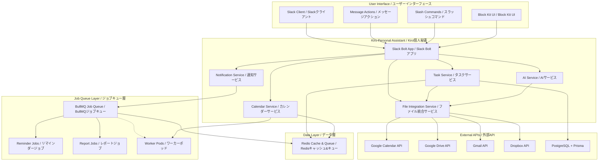
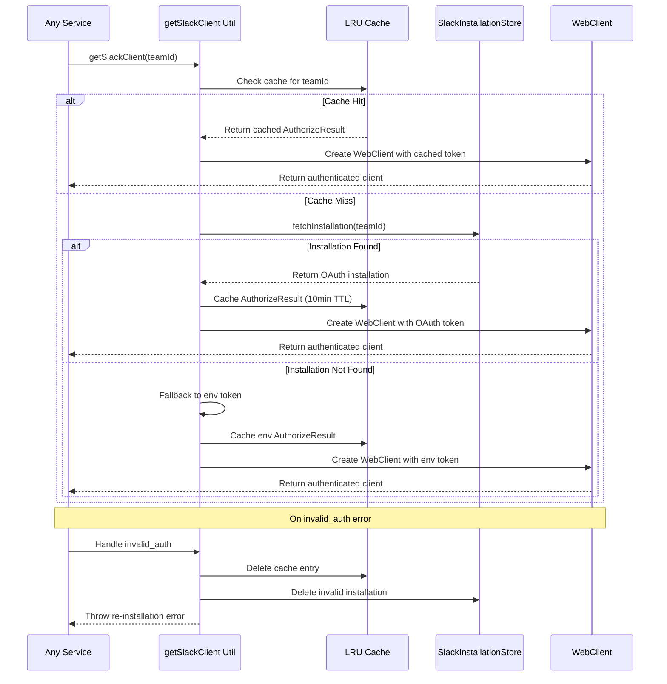
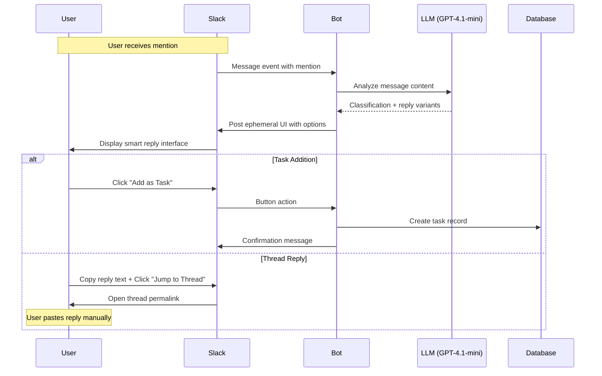
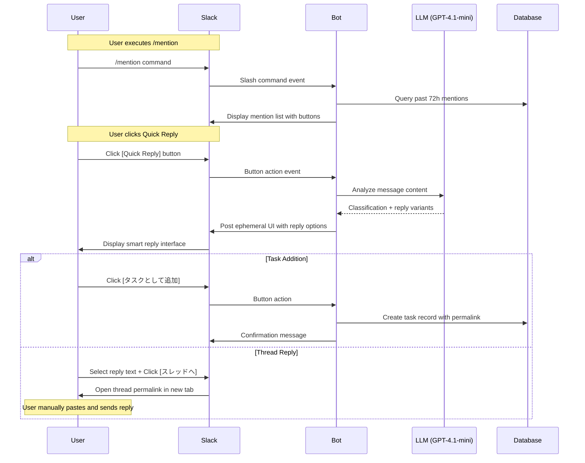
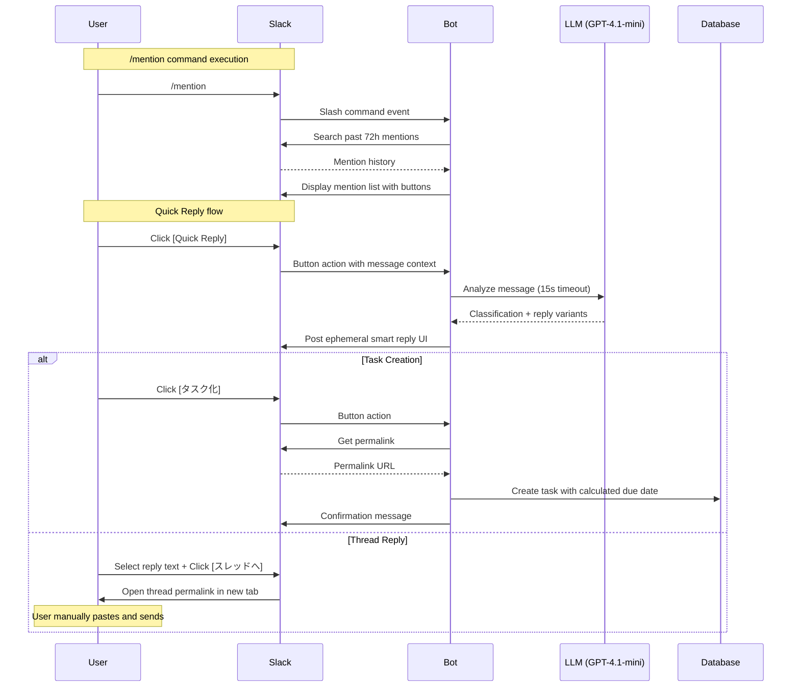

# Design Document / 設計書

## Overview / 概要

This document outlines the system design for the Slack Personal Assistant AI, focusing on enabling users to concentrate on their core work by eliminating friction in task management, scheduling, and communication workflows.

このドキュメントは、タスク管理、スケジューリング、コミュニケーションワークフローの摩擦を排除し、ユーザーが核となる作業に集中できるようにするSlack個人秘書AIのシステム設計を概説します。

## Architecture / アーキテクチャ

### System Architecture Overview / システムアーキテクチャ概要

**Legend / 凡例**: Solid lines = Synchronous calls / 実線 = 同期呼び出し, Dotted lines = Asynchronous processing / 点線 = 非同期処理



### Value-Driven Component Mapping / 価値駆動コンポーネントマッピング

| Core Value / 核心価値 | Primary Components / 主要コンポーネント | Supporting Services / 支援サービス |
|---|---|---|
| **"探さない・思い出さない"** | Task Service, File Integration Service | AI Service (summarization), Redis Cache |
| **"考える前に提示"** | Notification Service, Job Queue (Reminder Jobs) | Calendar Service, AI Service (prediction) |
| **"日程調整の摩擦ゼロ"** | Calendar Service, Message Action Handler | FreeBusy API, Block Kit Renderer |
| **"チャット＝秘書室"** | Mention Handler, Quick Reply Engine | AI Service (style learning), Inbox Manager |
| **"集中を守る"** | Focus Mode Manager, Notification Batcher | Context Analyzer, Priority Engine |

## Components and Interfaces / コンポーネントとインターフェース

### 1. Task Management System / タスク管理システム
**Value Alignment: "探さない・思い出さない" + "考える前に提示"**

```typescript
interface TaskService {
  // Daily Top 5 Display / 日次Top5表示
  getDailyTop5Tasks(userId: string): Promise<TaskCard[]>
  
  // Mention Inbox Processing / メンションインボックス処理
  processMention(mention: SlackMention): Promise<InboxEntry>
  
  // 3-Tier Hierarchy Management / 3階層管理
  suggestHierarchy(task: Task): Promise<HierarchySuggestion>
  
  // AI Reply Generation / AI返信生成
  generateQuickReplies(context: MessageContext, userStyle: UserStyle): Promise<string[]>
  
  // Task Completion Handler / タスク完了ハンドラー
  onTaskCompleted(taskId: string): Promise<void>
  onTaskSnoozed(taskId: string): Promise<void>
}

interface FileIntegrationService {
  // Multi-platform File Search / マルチプラットフォームファイル検索
  searchRecentFiles(query: string, timeRange: TimeRange, platforms: Platform[]): Promise<FileResult[]>
  
  // Document Summarization / 文書要約
  summarizeDocuments(files: FileResult[]): Promise<DocumentSummary>
  
  // Folder URL Detection / フォルダURL検出
  detectFolderUrls(text: string): Promise<FolderUrl[]>
  
  // Rate Limit Management / レート制限管理
  executeWithRateLimit(
    apiCall: () => Promise<any>, 
    provider: string, 
    options?: { maxRetries: 3, backoffMs: 2000 }  // Default: 3 retries, 2^n second backoff
  ): Promise<any>
}

interface TaskCard {
  id: string
  title: string
  priority: 'P1' | 'P2' | 'P3'
  badges: ('⚠️')[]  // Only warning badge for urgent/overdue tasks
  dueDate?: Date
  folderUrls: FolderUrl[]
  actions: TaskAction[]
}
```

### 2. Calendar Integration System / カレンダー統合システム
**Value Alignment: "日程調整の摩擦ゼロ"**

```typescript
interface CalendarService {
  // Message to Calendar Candidates / メッセージからカレンダー候補
  extractDateTimeCandidates(message: string): Promise<DateTimeCandidate[]>
  
  // FreeBusy Status Check / FreeBusy状況確認
  checkAvailability(candidates: DateTimeCandidate[], options: FreeBusyOptions): Promise<AvailabilityStatus[]>
  
  // Tentative Booking Management / 仮予定管理
  createTentativeEvents(candidates: DateTimeCandidate[]): Promise<TentativeEvent[]>
  
  // Week View URL Generation / 週ビューURL生成
  generateWeekViewUrl(date: Date): string
}

interface FreeBusyOptions {
  // Calendar Selection Strategy / カレンダー選択戦略
  includePrimary: boolean      // Primary calendar
  includeSelected: boolean     // User-selected calendars
  excludeDeclined: boolean     // Exclude declined events
}

### 4. Job Queue System / ジョブキューシステム
**Value Alignment: "考える前に提示"**

```typescript
interface JobQueueService {
  // Reminder Job Scheduling / リマインダージョブスケジューリング
  scheduleReminder(taskId: string, reminderTime: Date): Promise<JobId>
  
  // Daily Report Generation / 日次レポート生成
  scheduleDailyReport(userId: string, time: string): Promise<JobId>
  
  // Weekly Report Generation / 週次レポート生成
  scheduleWeeklyReport(userId: string, dayOfWeek: number, time: string): Promise<JobId>
  
  // Job Cancellation / ジョブキャンセル
  cancelJob(jobId: JobId): Promise<boolean>
  cancelReminderByTask(taskId: string): Promise<boolean>
}

interface NotificationService {
  // Reminder Management / リマインダー管理
  scheduleTaskReminder(task: Task): Promise<void>
  cancelReminder(taskId: string): Promise<boolean>  // Called on task completion/snooze
  
  // Focus Mode / 集中モード
  enableFocusMode(userId: string, duration: number): Promise<void>
  batchNotifications(userId: string): Promise<NotificationBatch>
}

interface DateTimeCandidate {
  startTime: Date
  endTime: Date
  status: 'free' | 'busy'
  indicators: ('✈️' | '🚶' | '⚠️')[]
  confidence: number
}
```

### 5. AI-Powered Intelligence Layer / AI駆動知能層
**Value Alignment: "考える前に提示" + "集中を守る"**

```typescript
interface AIService {
  // Priority Score Calculation / 優先度スコア計算
  calculatePriorityScore(task: Task, context: UserContext): Promise<number>
  
  // Document Summarization / 文書要約
  summarizeRecentDocuments(query: string, timeRange: TimeRange): Promise<DocumentSummary>
  
  // User Writing Style Learning / ユーザー文体学習
  learnWritingStyle(messages: SlackMessage[]): Promise<UserStyle>
  
  // Context-Aware Response / コンテキスト認識応答
  adaptResponseToContext(message: string, userState: UserState): Promise<string>
}

interface DocumentSummary {
  projectName: string
  background: string
  participants: string[]
  keyIssues: string[]
  relevantFiles: FileReference[]
}

// Smart Reply System / スマート返信システム
interface SmartReplyService {
  // Message Analysis / メッセージ分析
  analyzeMessage(messageText: string): Promise<MessageAnalysis>
  
  // Reply Generation / 返信生成
  generateReplyOptions(analysis: MessageAnalysis, userStyle: UserStyle): Promise<ReplyOptions>
  
  // UI Generation / UI生成
  buildReplyUI(analysis: MessageAnalysis, messageText: string): Promise<SlackBlockKit>
}

interface MessageAnalysis {
  type: 'scheduling_request' | 'generic_request'
  dates?: Array<{date: string, part_of_day: 'morning' | 'afternoon' | 'evening'}>
  intent_variants?: {
    agree_polite: string
    agree_casual: string
    reject_polite: string
    reject_casual: string
  }
  confidence: number
  language: 'ja' | 'en'
}

interface ReplyOptions {
  scheduling?: {
    agree_polite: string
    agree_casual: string
    reject_polite: string
    reject_casual: string
    calendar_link: string
  }
  generic?: {
    agree_polite: string
    agree_casual: string
    reject_polite: string
    reject_casual: string
  }
}
```

## Data Models / データモデル

### Core Entities / 核心エンティティ

```prisma
model User {
  id          String   @id @default(cuid())
  slackUserId String   @unique
  timezone    String   @default("UTC")
  language    String   @default("ja")
  preferences Json     @default("{}")
  
  tasks       Task[]
  inboxItems  InboxItem[]
  focusSessions FocusSession[]
  
  createdAt   DateTime @default(now())
  updatedAt   DateTime @updatedAt
}

model Task {
  id            String    @id @default(cuid())
  title         String
  description   String?
  status        TaskStatus @default(PENDING)
  priority      Priority   @default(P2)
  priorityScore Float      @default(0)
  
  // 3-Tier Hierarchy / 3階層
  level         TaskLevel  @default(SUB_TASK)
  parentId      String?
  parent        Task?      @relation("TaskHierarchy", fields: [parentId], references: [id])
  children      Task[]     @relation("TaskHierarchy")
  
  // Folder Integration / フォルダ統合
  folderUrls    Json       @default("[]")
  
  // Scheduling / スケジューリング
  dueDate       DateTime?
  reminderSent  Boolean    @default(false)
  
  userId        String
  user          User       @relation(fields: [userId], references: [id])
  
  createdAt     DateTime   @default(now())
  updatedAt     DateTime   @updatedAt
}

model InboxItem {
  id          String      @id @default(cuid())
  slackTs     String      @unique
  channelId   String
  messageText String
  status      InboxStatus @default(PENDING)
  
  // Auto-cleanup / 自動クリーンアップ
  expiresAt   DateTime
  
  userId      String
  user        User        @relation(fields: [userId], references: [id])
  
  createdAt   DateTime    @default(now())
  updatedAt   DateTime    @updatedAt
}

model CalendarEvent {
  id          String   @id @default(cuid())
  googleId    String?  @unique
  title       String
  startTime   DateTime
  endTime     DateTime
  status      EventStatus @default(TENTATIVE)
  
  // Tentative Naming / 仮予定命名
  sequenceNumber Int?
  totalInGroup   Int?
  
  userId      String
  
  createdAt   DateTime @default(now())
  updatedAt   DateTime @updatedAt
}

model OAuthToken {
  id           String    @id @default(cuid())
  provider     Provider
  accessToken  String
  refreshToken String?
  expiresAt    DateTime?
  scope        String[]
  
  userId       String
  user         User      @relation(fields: [userId], references: [id])
  
  createdAt    DateTime  @default(now())
  updatedAt    DateTime  @updatedAt
  
  @@unique([userId, provider])
}

model JobQueue {
  id          String    @id @default(cuid())
  jobType     JobType
  payload     Json
  scheduledAt DateTime
  status      JobStatus @default(PENDING)
  attempts    Int       @default(0)
  maxAttempts Int       @default(3)
  
  userId      String?
  
  createdAt   DateTime  @default(now())
  updatedAt   DateTime  @updatedAt
}

enum TaskStatus {
  PENDING
  IN_PROGRESS
  COMPLETED
  CANCELLED
}

enum Priority {
  P1
  P2
  P3
}

enum TaskLevel {
  PROJECT
  MID_TASK
  SUB_TASK
}

enum InboxStatus {
  PENDING
  CONVERTED_TO_TASK
  IGNORED
  QUICK_REPLIED
}

enum EventStatus {
  TENTATIVE
  CONFIRMED
  CANCELLED
}

enum Provider {
  GOOGLE_CALENDAR
  GOOGLE_DRIVE
  GMAIL
  NOTION
  DROPBOX
}

enum JobType {
  REMINDER
  DAILY_REPORT
  WEEKLY_REPORT
  FILE_SUMMARY
}

enum JobStatus {
  PENDING
  PROCESSING
  COMPLETED
  FAILED
  CANCELLED
}
```

## Error Handling / エラーハンドリング

### Graceful Degradation Strategy / 段階的劣化戦略

```typescript
interface ErrorHandlingStrategy {
  // API Failures / API障害
  handleGoogleAPIFailure(error: GoogleAPIError): Promise<FallbackResponse>
  
  // Processing Timeouts / 処理タイムアウト
  handleLongRunningProcess(processId: string): Promise<ProgressUpdate>
  
  // User-Friendly Error Messages / ユーザーフレンドリーなエラーメッセージ
  formatErrorForUser(error: SystemError, language: 'ja' | 'en'): string
}

// Progress Indication for Long Operations / 長時間処理の進捗表示
interface ProgressUpdate {
  message: string
  estimatedTimeRemaining: number
  currentStep: string
  totalSteps: number
}
```

## Testing Strategy / テスト戦略

### Test Coverage Requirements / テストカバレッジ要件

- **Unit Tests**: ≥80% coverage for core business logic
- **Integration Tests**: All external API interactions
- **E2E Tests**: Critical user workflows (task creation, calendar integration)
- **Performance Tests**: Response time targets (≤3s basic, ≤30s complex)
- **AI Quality Tests**: 
  - Document summarization BLEU score ≥ 0.3
  - Content toxicity score ≤ 0.1 (Perspective API)
  - Reply generation relevance score ≥ 0.8

### Key Test Scenarios / 主要テストシナリオ

1. **Daily Top 5 Display**: Morning 7:30 trigger and /todo today command
2. **Calendar Integration**: Message action → candidate list → week view → reply draft
3. **Mention Processing**: Auto-inbox → 3-button interface → task creation
4. **Reminder System**: P1 task reminders at specified times
5. **Multi-language Support**: Japanese ↔ English switching

## Security Considerations / セキュリティ考慮事項

### Data Protection / データ保護

- **Encryption at Rest**: All user data encrypted in PostgreSQL
- **Encryption in Transit**: TLS 1.3 for all API communications
- **OAuth Delegation**: User-authorized access to external services
- **Minimal Permissions**: Least privilege principle for all integrations

### Privacy Compliance / プライバシー準拠

- **Data Retention**: Configurable retention periods for different data types
- **User Consent**: Clear consent flow for AI learning from user messages
- **Data Portability**: Export functionality for user data
- **Right to Deletion**: Complete data removal on user request

## Observability / 可観測性

### Logging Strategy / ログ戦略
- **Framework**: Winston → Loki (JSON structured logging)
- **Log Levels**: info and above in production, debug in development
- **Structured Format**: Include userId, requestId, service, timestamp, and context
- **Privacy**: No sensitive data (tokens, personal info) in logs

### Metrics and Monitoring / メトリクスと監視
- **Collection**: Prometheus metrics with Grafana dashboards
- **Key Performance Indicators**:
  - API Response Time: p95 ≤ 3s, p99 ≤ 10s
  - Job Queue Lag: ≤ 30s for all job types
  - External API Success Rate: ≥ 99%
  - Task Completion Rate: Daily tracking
- **Alerting**: PagerDuty integration for critical failures

### Distributed Tracing / 分散トレーシング
- **Framework**: OpenTelemetry SDK → Jaeger collector
- **Trace Coverage**: All external API calls, job processing, user interactions
- **Correlation**: Request tracing across service boundaries
- **Performance**: Identify bottlenecks in complex workflows

---

## Phase 2: OAuth Dynamic Token Management / Phase 2: OAuth動的トークン管理

### Runtime Auth Flow Enhancement / ランタイム認証フロー強化



### Core Utility Implementation / コアユーティリティ実装

```typescript
// Phase 2 Addition: Dynamic Token Resolution Utility
interface SlackClientUtil {
  // Primary method for all Slack API access
  getSlackClient(teamId: string): Promise<WebClient>
  
  // Cache management
  clearCache(teamId?: string): void
  getCacheStats(): CacheStats
  
  // Error recovery
  handleInvalidAuth(teamId: string): Promise<void>
}

// LRU Cache Configuration
interface AuthCacheConfig {
  max: 500                    // Maximum 500 teams
  ttl: 10 * 60 * 1000        // 10 minutes TTL (600 seconds)
  updateAgeOnGet: true        // Reset TTL on access
  dispose: (value: AuthorizeResult, key: string) => void
}

// Reference: npm lru-cache v7+ 
// https://www.npmjs.com/package/lru-cache
// Memory estimation: ~200KB per cached team × 500 = ~100MB max

// Enhanced Worker Configuration
interface WorkerConfig {
  connection: Redis
  reuseRedis: true           // Critical for BullMQ v4.7+
  limiter: {
    max: 50                  // Rate limit: 50 jobs per minute
    duration: 60000
  }
}
```

### Performance Characteristics / パフォーマンス特性

| Metric / メトリクス | Target / 目標 | Monitoring / 監視 |
|---|---|---|
| Cache Hit Rate | >90% | auth_cache_hit_rate |
| API Latency P95 | <200ms | api_latency_p95 |
| Worker Queue Depth | <1000 | worker_queue_depth |
| Error Rate | <0.1% | error_rate |
| Memory Usage | <100MB for cache | auth_cache_memory_usage |

### Error Handling Strategy / エラーハンドリング戦略

```typescript
// Phase 2 Addition: Comprehensive Error Recovery
class AuthErrorHandler {
  async handleInvalidAuth(teamId: string): Promise<void> {
    // 1. Clear cache
    authCache.delete(teamId);
    
    // 2. Delete invalid installation
    await slackInstallationStore.deleteInstallation({ teamId });
    
    // 3. Log for monitoring
    logger.error('Invalid auth detected', { teamId });
    
    // 4. Notify user for re-installation
    await this.sendReinstallationNotice(teamId);
  }
  
  private async sendReinstallationNotice(teamId: string): Promise<void> {
    // User-friendly re-installation guidance
    // Include direct link to /slack/install
  }
}
```

## Implementation Phases / 実装フェーズ

### Phase 1: MVP Core (6 weeks = 3 × 2-week sprints)
**Sprint 1 (Weeks 1-2): Foundation**
- Basic Slack Integration with onboarding
- Job Queue infrastructure (BullMQ + Redis)
- OAuth Token management
- **Done Criteria**: Bot responds to /help, OAuth tokens stored securely, Job queue processes test jobs

**Sprint 2 (Weeks 3-4): Core Features**
- Smart Task Management (P-1 to P-2: Daily Top 5, Folder Access)
- Smart Calendar Integration (Message Actions, Candidate Display)
- Reminder system with cancellation flow
- **Done Criteria**: /todo today shows Top 5 tasks, 🗓 Open in Calendar works, Reminders can be scheduled/cancelled

**Sprint 3 (Weeks 5-6): Integration & Polish**
- Smart Task Management (P-3 to P-4: Reminders, Mention Inbox)
- Calendar Integration (Reply Drafts, Tentative Booking)
- User Experience & Performance optimization
- **Done Criteria**: Mention inbox with 3-button flow, Calendar reply drafts, All APIs respond within SLA targets

### Phase 2: Booster Features (4 weeks = 2 × 2-week sprints)
- Advanced Task Management (P-5 to P-8)
- Communication Pattern Analysis
- Enhanced Calendar features

### Phase 3: Future Enhancements (TBD)
- Voice-to-Action Processing
- Advanced Context Intelligence
- Cross-platform integrations

This design ensures that every component directly supports the core concept of helping users "focus on what they should really be doing" through intelligent automation and friction reduction.

この設計により、すべてのコンポーネントが、インテリジェントな自動化と摩擦の削減を通じて、ユーザーが「本来やるべきことに集中する」というコアコンセプトを直接支援することを保証します。
###
 Technical Implementation Notes / 技術実装メモ

#### Core Configuration / コア設定
- **Google Calendar Week View URL**: `https://calendar.google.com/calendar/u/0/r/week/YYYY/MM/DD`
- **Priority Score Algorithm**: `score = (due_date_urgency * 0.6) + (completion_pattern_weight * 0.4) + context_boost`
- **Response Time Targets**: Basic operations ≤3s, Complex analysis ≤30s with progress indicators
- **Timezone**: All scheduled times (7:30 AM, 8:00 AM, 9:00 AM) use user's Slack timezone setting

#### Multi-language Support / 多言語サポート
- **Travel Keywords**: Configurable via i18n JSON files
  ```json
  {
    "ja": ["出張", "大阪", "名古屋", "福岡", "空港", "新幹線", "移動", "飛行機"],
    "en": ["business trip", "travel", "airport", "flight", "train", "meeting"]
  }
  ```
- **Quick Reply Learning**: Includes both DM and public channel messages from user (last 100 messages)

#### Calendar Integration / カレンダー統合
- **FreeBusy Scope**: Primary calendar (primary=true) + user-selected calendars (selected=true)
- **Google Calendar Tentative API**: `transparency: 'opaque', responseStatus: 'tentative'` for 仮予定
- **Multiple Calendar Handling**: Aggregate FreeBusy from all enabled calendars to avoid false positives

#### External API Management / 外部API管理
- **Rate Limiting**: Implement exponential backoff for all external APIs
- **OAuth Token Management**: Automatic refresh with fallback to user re-authorization
- **Search Permissions**: User OAuth delegation for Drive/Dropbox/Notion access (not BOT service account)
- **API Failure Handling**: Graceful degradation with cached results when possible

#### Job Queue Configuration / ジョブキュー設定
- **Queue Backend**: Redis with BullMQ for job processing
- **Retry Policy**: Exponential backoff with max 3 attempts
- **Job Types**: Reminder, Daily Report, Weekly Report, File Summary
- **Cleanup**: Automatic removal of completed jobs after 7 days

#### Security Enhancements / セキュリティ強化
- **Secrets Management**: Use AWS Secrets Manager or GCP Secret Manager (no .env files in repository)
- **Token Storage**: Encrypted OAuth tokens with automatic refresh on expiration
- **API Key Isolation**: Separate service accounts for different external APIs
- **Audit Logging**: All external API calls and user actions logged for compliance

#### OAuth Token Refresh Strategy / OAuthトークンリフレッシュ戦略
- **Automatic Refresh**: Check token expiration before each API call
- **Fallback Handling**: Graceful degradation when refresh fails
- **User Re-authorization**: Clear flow for expired refresh tokens
- **Error Recovery**: Retry with exponential backoff for transient failures

---

## Appendix: Priority Score Algorithm Details / 付録: 優先度スコア算出詳細

### Mathematical Formula / 数式
```
Priority Score = (Due Date Component * 0.6) + (Completion Pattern Component * 0.4) + Context Boost

Where:
- Due Date Component = max(0, 1 - log(days_until_due + 2) / log(30))
- Completion Pattern Component = beta_distribution(completed_similar_tasks, total_similar_tasks)
- Context Boost = focus_mode_boost + vip_sender_boost + keyword_urgency_boost

Context Boost Details:
- focus_mode_boost = user_in_focus_mode ? 5 : 0
- vip_sender_boost = sender_is_vip ? 3 : 0  
- keyword_urgency_boost = urgent_keywords_count * 2
```

### Implementation Example / 実装例
```typescript
function calculatePriorityScore(task: Task, context: UserContext): number {
  const dueDateComponent = calculateDueDateUrgency(task.dueDate);
  const completionComponent = calculateCompletionPattern(task, context.taskHistory);
  const contextBoost = calculateContextBoost(task, context);
  
  return (dueDateComponent * 0.6) + (completionComponent * 0.4) + contextBoost;
}
```

This enhanced design addresses all critical implementation concerns while maintaining the core concept of helping users focus on what they should really be doing.

この強化された設計は、ユーザーが本来やるべきことに集中することを支援するというコアコンセプトを維持しながら、すべての重要な実装上の懸念に対処しています。
## Sm
art Reply System Design / スマート返信システム設計

### Overview / 概要

The Smart Reply System enables users to respond to Slack mentions with minimal friction through AI-powered message analysis and contextual reply generation. The system reduces response time from 30+ seconds to under 5 seconds while maintaining zero false positives.

スマート返信システムは、AI駆動のメッセージ分析とコンテキスト返信生成により、ユーザーがSlackメンションに最小限の摩擦で応答できるようにします。システムは応答時間を30秒以上から5秒未満に短縮し、誤検出ゼロを維持します。

### Architecture Flow / アーキテクチャフロー



### Core Components / コアコンポーネント

#### 1. Message Analyzer / メッセージアナライザー

**Purpose**: Classify Slack messages and extract actionable information using LLM analysis.

**目的**: LLM分析を使用してSlackメッセージを分類し、実行可能な情報を抽出する。

```typescript
class MessageAnalyzer {
  private openai: OpenAI;
  
  async analyzeMessage(messageText: string): Promise<MessageAnalysis> {
    // System prompt with few-shot examples
    // JSON-only response format
    // 15-second timeout with fallback
  }
  
  private buildSystemPrompt(): string {
    // Role definition
    // Classification types (scheduling_request | generic_request)
    // Output format specification
    // Few-shot examples for accuracy
  }
}
```

**LLM Configuration**:
- **Model**: GPT-4.1-mini (cost-efficient, high-quality)
- **Temperature**: 0.2 (consistent, deterministic responses)
- **Timeout**: 15 seconds with graceful fallback
- **Fallback**: Default to `generic_request` with standard templates

#### 2. Smart Reply UI Builder / スマート返信UIビルダー

**Purpose**: Generate contextual Slack Block Kit interfaces based on message analysis.

**目的**: メッセージ分析に基づいてコンテキストSlack Block Kit インターフェースを生成する。

```typescript
class SmartReplyUIBuilder {
  buildUI(analysis: MessageAnalysis, messageText: string): SlackBlockKit {
    return analysis.type === 'scheduling_request'
      ? this.buildSchedulingUI(analysis, messageText)
      : this.buildGenericUI(analysis, messageText);
  }
  
  private buildSchedulingUI(analysis: MessageAnalysis, messageText: string): SlackBlockKit {
    // Calendar week link generation
    // 4-quadrant reply options (polite/casual × agree/reject)
    // Task addition and thread jump buttons
  }
  
  private buildGenericUI(analysis: MessageAnalysis, messageText: string): SlackBlockKit {
    // Context-aware reply variants
    // Intent-based response options
    // Action buttons for task management
  }
}
```

**UI Design Principles**:
- **Zero False Positives**: Manual confirmation required for all actions
- **2-Operation Flow**: Copy text → Jump to thread (maximum efficiency)
- **Contextual Adaptation**: Different UI layouts for scheduling vs. generic requests
- **Accessibility**: Selectable text instead of copy buttons (Slack limitation)

#### 3. Task Integration / タスク統合

**Purpose**: Seamlessly convert mentions into actionable tasks with proper metadata.

**目的**: メンションを適切なメタデータを持つ実行可能なタスクにシームレスに変換する。

```typescript
interface TaskCreationFlow {
  // User mapping (Slack ID → Internal User ID)
  resolveUser(slackUserId: string): Promise<User>
  
  // Permalink generation for context
  generatePermalink(channelId: string, messageTs: string): Promise<string>
  
  // Due date calculation based on message type
  calculateDueDate(type: MessageType, dates?: Date[]): Date
  
  // Task creation with full context
  createTaskFromMention(analysis: MessageAnalysis, metadata: MessageMetadata): Promise<Task>
}
```

**Due Date Logic**:
- **Scheduling Requests**: Day before first proposed date at 23:59 JST
- **Generic Requests**: Next business day at 18:00 JST
- **Business Day Calculation**: Excludes weekends, respects JST timezone

### Data Flow / データフロー

#### 1. Message Processing Pipeline / メッセージ処理パイプライン

```typescript
// Event trigger
app.event('message', async ({ event, client }) => {
  // 1. Bot mention detection
  if (!event.text?.includes(`<@${BOT_USER_ID}>`)) return;
  
  // 2. LLM analysis
  const analysis = await messageAnalyzer.analyzeMessage(event.text);
  
  // 3. UI generation
  const blocks = uiBuilder.buildUI(analysis, event.text);
  
  // 4. Ephemeral display
  await client.chat.postEphemeral({
    channel: event.channel,
    user: event.user,
    blocks
  });
});
```

#### 2. Action Handling / アクション処理

```typescript
// Task addition flow
app.action('add_task_from_smart_reply', async ({ ack, body, client }) => {
  await ack();
  
  // 1. User resolution
  const user = await prisma.user.upsert({
    where: { slackUserId: body.user.id },
    update: {},
    create: { slackUserId: body.user.id, /* defaults */ }
  });
  
  // 2. Permalink generation
  const permalink = await client.chat.getPermalink({
    channel: body.channel.id,
    message_ts: body.message.ts
  });
  
  // 3. Task creation
  await prisma.task.create({
    data: {
      title: extractedTitle,
      slackPermalink: permalink.permalink,
      dueDate: calculatedDueDate,
      userId: user.id,
      // ... other fields
    }
  });
});
```

### Error Handling & Resilience / エラーハンドリングと回復力

#### 1. LLM Failure Handling / LLM障害処理

```typescript
try {
  const response = await this.openai.chat.completions.create({
    // ... configuration
    timeout: 15_000
  });
  return AnalysisSchema.parse(JSON.parse(response.content));
} catch (error) {
  console.error('OpenAI analysis failed:', error);
  
  // Graceful fallback to generic template
  return {
    type: 'generic_request',
    intent_variants: {
      agree_polite: '承知いたしました。対応いたします。',
      agree_casual: 'わかりました！やりますね',
      reject_polite: '申し訳ありません、難しい状況です。',
      reject_casual: 'ごめん、ちょっと厳しいかも'
    }
  };
}
```

#### 2. Slack API Resilience / Slack API回復力

```typescript
try {
  await client.chat.postEphemeral({ /* ... */ });
} catch (error) {
  console.error('Slack API error:', error);
  
  // Fallback error message
  await client.chat.postEphemeral({
    channel: event.channel,
    user: event.user,
    text: '⚠️ 一時的に返信案を生成できませんでした。後ほどもう一度お試しください。'
  });
}
```

### Performance Characteristics / パフォーマンス特性

#### Response Time Targets / 応答時間目標

- **LLM Analysis**: < 3 seconds (with 15s timeout)
- **UI Generation**: < 100ms
- **Total User Response**: < 5 seconds
- **Task Creation**: < 1 second

#### Scalability Considerations / スケーラビリティ考慮事項

- **Stateless Design**: No session storage, fully event-driven
- **LLM Rate Limiting**: Built-in OpenAI rate limit handling
- **Database Optimization**: Indexed queries for user lookup
- **Memory Efficiency**: BOT_USER_ID cached at startup

### Security & Privacy / セキュリティとプライバシー

#### Data Handling / データ処理

- **Message Content**: Sent to OpenAI for analysis (ephemeral)
- **User Mapping**: Slack User ID ↔ Internal User ID only
- **Permalink Storage**: Full Slack permalink for context retention
- **No Message Persistence**: Original message content not stored

#### API Security / APIセキュリティ

- **OAuth Scopes**: Minimal required permissions
  - Bot: `chat:write`, `chat:write.public`, `commands`, `chat:write.customize`
  - User: `channels:history`, `groups:history`, `channels:read`, `groups:read`
- **Token Management**: Secure storage of bot and user tokens
- **Rate Limiting**: Respect OpenAI and Slack API limits

### Integration Points / 統合ポイント

#### Existing System Integration / 既存システム統合

- **Task Service**: Reuses existing `createTaskFromMention()` method
- **User Management**: Leverages existing User model with `slackUserId` field
- **Database**: PostgreSQL with Prisma ORM (consistent with existing architecture)
- **Logging**: Integrated with existing Winston logging infrastructure

#### Future Extension Points / 将来の拡張ポイント

- **Multi-language Support**: Template localization framework ready
- **User Style Learning**: Placeholder for personalized reply generation
- **Calendar Integration**: Ready for FreeBusy API integration
- **Advanced Context**: Conversation history analysis capability

### Monitoring & Observability / 監視と可観測性

#### Key Metrics / 主要メトリクス

- **Response Time**: End-to-end mention → UI display latency
- **LLM Accuracy**: Classification accuracy vs. manual validation
- **Task Conversion Rate**: Mentions → Tasks conversion percentage
- **Error Rates**: LLM failures, Slack API errors, database errors

#### Logging Strategy / ログ戦略

```typescript
// Structured logging for analysis
logger.info('Smart reply generated', {
  messageType: analysis.type,
  confidence: analysis.confidence,
  responseTime: processingTime,
  userId: event.user,
  channelId: event.channel
});
```

### Testing Strategy / テスト戦略

#### Unit Testing / 単体テスト

- **MessageAnalyzer**: Mock OpenAI responses, test classification accuracy
- **SmartReplyUIBuilder**: Validate Block Kit structure generation
- **Task Integration**: Test user mapping and task creation flows

#### Integration Testing / 統合テスト

- **End-to-End Flow**: Mention → Analysis → UI → Task Creation
- **Error Scenarios**: LLM timeout, Slack API failures, database errors
- **Performance Testing**: Response time under load

#### Acceptance Criteria / 受け入れ基準

- [ ] Mention response time < 5 seconds (95th percentile)
- [ ] Zero false positive task creation
- [ ] Scheduling requests show calendar links
- [ ] Generic requests show 4-quadrant reply options
- [ ] Task creation includes proper metadata (permalink, due date)
- [ ] Error handling provides user-friendly fallbacks

This Smart Reply System design provides a comprehensive foundation for AI-powered, friction-free Slack communication while maintaining the core principles of user control and zero false positives.

このスマート返信システム設計は、ユーザー制御と誤検出ゼロの核心原則を維持しながら、AI駆動の摩擦のないSlackコミュニケーションの包括的な基盤を提供します。
## Qui
ck Reply & /mention MVP System Design / Quick Reply & /mention MVPシステム設計

### Overview / 概要

The Quick Reply & /mention MVP System enables users to manage mentions efficiently with AI-powered contextual reply suggestions through a 2-operation workflow (copy text → jump to thread). The system achieves zero false positives by never auto-sending messages and requiring manual confirmation for all actions.

Quick Reply & /mention MVPシステムは、2操作ワークフロー（テキストコピー→スレッドジャンプ）を通じてAI駆動のコンテキスト返信提案でメンションを効率的に管理できるようにします。システムはメッセージを自動送信せず、すべてのアクションに手動確認を要求することで誤爆ゼロを実現します。

### Core Design Principles / コア設計原則

1. **誤爆ゼロ設計**: AIは送らない・貼らない・自動コピーしない
2. **最短2操作**: ①返信文をコピー ②「スレッドへ」ジャンプ
3. **メンション中心ワークフロー**: /mention一覧 → Quick Reply or タスク化
4. **手動確認必須**: すべてのアクションにユーザーの明示的確認が必要

### Architecture Flow / アーキテクチャフロー



### Core Components / コアコンポーネント

#### 1. Mention Manager / メンション管理

**Purpose**: Collect and manage Slack mentions with 72-hour retention and filtering capabilities.

**目的**: 72時間保持とフィルタリング機能でSlackメンションを収集・管理する。

```typescript
class MentionManager {
  async getMentions(userId: string, options: MentionOptions): Promise<MentionEntry[]> {
    // Search past 72h mentions using Slack search API
    // Filter by reply status (all, unreplied)
    // Format for Block Kit display
  }
  
  async markAsRead(mentionId: string): Promise<void> {
    // Update mention status to read
    // Remove from unreplied list
  }
}

interface MentionOptions {
  filter: 'all' | 'unreplied'
  timeRange: '72h'  // Fixed for MVP
}

interface MentionEntry {
  id: string
  channelId: string
  channelName: string
  userId: string
  userName: string
  messageText: string
  timestamp: string
  status: 'unread' | 'read' | 'replied'
  permalink: string
}
```

#### 2. Message Analyzer / メッセージアナライザー

**Purpose**: Classify Slack messages and extract actionable information using GPT-4.1-mini with strict JSON output format.

**目的**: GPT-4.1-miniを使用して厳密なJSON出力形式でSlackメッセージを分類し、実行可能な情報を抽出する。

```typescript
class MessageAnalyzer {
  private openai: OpenAI;
  
  async analyzeMessage(messageText: string): Promise<MessageAnalysis> {
    const systemPrompt = this.buildSystemPrompt();
    
    try {
      const response = await this.openai.chat.completions.create({
        model: 'gpt-4.1-mini',
        temperature: 0.2,
        timeout: 15_000,
        messages: [
          { role: 'system', content: systemPrompt },
          { role: 'user', content: JSON.stringify({ message_text: messageText }) }
        ]
      });
      
      return JSON.parse(response.choices[0].message.content);
    } catch (error) {
      // Graceful fallback to generic_request
      return this.getGenericFallback();
    }
  }
  
  private buildSystemPrompt(): string {
    return `
You are a message classifier for Slack mentions. Analyze the message and respond with JSON only.

Output format:
{
  "type": "scheduling_request" | "generic_request",
  "dates": [{"date": "YYYY-MM-DD", "part_of_day": "morning|afternoon|evening"}],
  "intent_variants": {
    "agree_polite": "...",
    "agree_casual": "...",
    "reject_polite": "...",
    "reject_casual": "..."
  }
}

Classification rules:
- scheduling_request: Contains date/time proposals, meeting requests
- generic_request: General requests, questions, confirmations

Reply variants should be natural Japanese responses appropriate for business context.
    `;
  }
  
  private getGenericFallback(): MessageAnalysis {
    return {
      type: 'generic_request',
      intent_variants: {
        agree_polite: '承知いたしました。確認してお戻しいたします。',
        agree_casual: 'わかったー！確認するね。',
        reject_polite: '恐れ入ります、すぐには対応が難しい状況です。少しお時間いただけますでしょうか。',
        reject_casual: 'ごめん、ちょっと難しいかも！'
      }
    };
  }
}

interface MessageAnalysis {
  type: 'scheduling_request' | 'generic_request'
  dates?: Array<{date: string, part_of_day: 'morning' | 'afternoon' | 'evening'}>
  intent_variants: {
    agree_polite: string
    agree_casual: string
    reject_polite: string
    reject_casual: string
  }
}
```

#### 3. Smart Reply UI Builder / スマート返信UIビルダー

**Purpose**: Generate contextual Slack Block Kit interfaces with manual text selection and thread jump functionality.

**目的**: 手動テキスト選択とスレッドジャンプ機能を持つコンテキストSlack Block Kitインターフェースを生成する。

```typescript
class SmartReplyUIBuilder {
  buildUI(analysis: MessageAnalysis, messageText: string, channelId: string, messageTs: string): SlackBlockKit {
    return analysis.type === 'scheduling_request'
      ? this.buildSchedulingUI(analysis, messageText, channelId, messageTs)
      : this.buildGenericUI(analysis, messageText, channelId, messageTs);
  }
  
  private buildSchedulingUI(analysis: MessageAnalysis, messageText: string, channelId: string, messageTs: string): SlackBlockKit {
    const calendarWeekUrl = this.generateCalendarWeekUrl(analysis.dates?.[0]?.date);
    
    return {
      blocks: [
        {
          type: 'section',
          text: {
            type: 'mrkdwn',
            text: '📩 *日程調整メッセージを検出しました*'
          }
        },
        {
          type: 'section',
          text: {
            type: 'mrkdwn',
            text: `> ${messageText.substring(0, 100)}...`
          }
        },
        {
          type: 'section',
          text: {
            type: 'mrkdwn',
            text: `📅 <${calendarWeekUrl}|該当週カレンダーを開く>`
          }
        },
        {
          type: 'section',
          text: {
            type: 'mrkdwn',
            text: `🟢 日程OK（丁寧）\n> ${analysis.intent_variants.agree_polite}`
          }
        },
        {
          type: 'section',
          text: {
            type: 'mrkdwn',
            text: `🟢 日程OK（カジュアル）\n> ${analysis.intent_variants.agree_casual}`
          }
        },
        {
          type: 'section',
          text: {
            type: 'mrkdwn',
            text: `🔴 日程NG（丁寧）\n> ${analysis.intent_variants.reject_polite}`
          }
        },
        {
          type: 'section',
          text: {
            type: 'mrkdwn',
            text: `🔴 日程NG（カジュアル）\n> ${analysis.intent_variants.reject_casual}`
          }
        },
        {
          type: 'section',
          text: {
            type: 'mrkdwn',
            text: '**返信する場合は、上記メッセージ案をコピーし、下記ボタンでスレッドへ飛んでください。**'
          }
        },
        {
          type: 'actions',
          elements: [
            {
              type: 'button',
              text: { type: 'plain_text', text: 'タスクとして追加' },
              action_id: 'add_task_from_smart_reply',
              value: JSON.stringify({ channelId, messageTs, messageText })
            },
            {
              type: 'button',
              text: { type: 'plain_text', text: 'スレッドへ' },
              action_id: 'thread_reply_jump',
              value: JSON.stringify({ channelId, messageTs }),
              url: `slack://channel?team=${process.env.SLACK_TEAM_ID}&id=${channelId}&message=${messageTs}`
            }
          ]
        }
      ]
    };
  }
  
  private buildGenericUI(analysis: MessageAnalysis, messageText: string, channelId: string, messageTs: string): SlackBlockKit {
    return {
      blocks: [
        {
          type: 'section',
          text: {
            type: 'mrkdwn',
            text: '📩 *依頼 / 確認メッセージを検出しました*'
          }
        },
        {
          type: 'section',
          text: {
            type: 'mrkdwn',
            text: `> ${messageText.substring(0, 100)}...`
          }
        },
        {
          type: 'section',
          text: {
            type: 'mrkdwn',
            text: `🟢 了解（丁寧）\n> ${analysis.intent_variants.agree_polite}`
          }
        },
        {
          type: 'section',
          text: {
            type: 'mrkdwn',
            text: `🟢 了解（カジュアル）\n> ${analysis.intent_variants.agree_casual}`
          }
        },
        {
          type: 'section',
          text: {
            type: 'mrkdwn',
            text: `🔴 難しい / 要調整（丁寧）\n> ${analysis.intent_variants.reject_polite}`
          }
        },
        {
          type: 'section',
          text: {
            type: 'mrkdwn',
            text: `🔴 難しい / 要調整（カジュアル）\n> ${analysis.intent_variants.reject_casual}`
          }
        },
        {
          type: 'section',
          text: {
            type: 'mrkdwn',
            text: '**返信する場合は、上記メッセージ案をコピーし、下記ボタンでスレッドへ飛んでください。**'
          }
        },
        {
          type: 'actions',
          elements: [
            {
              type: 'button',
              text: { type: 'plain_text', text: 'タスクとして追加' },
              action_id: 'add_task_from_smart_reply',
              value: JSON.stringify({ channelId, messageTs, messageText })
            },
            {
              type: 'button',
              text: { type: 'plain_text', text: 'スレッドで返信する' },
              action_id: 'thread_reply_jump',
              value: JSON.stringify({ channelId, messageTs }),
              url: `slack://channel?team=${process.env.SLACK_TEAM_ID}&id=${channelId}&message=${messageTs}`
            }
          ]
        }
      ]
    };
  }
  
  private generateCalendarWeekUrl(dateString?: string): string {
    const date = dateString ? new Date(dateString) : new Date();
    const year = date.getFullYear();
    const month = String(date.getMonth() + 1).padStart(2, '0');
    const day = String(date.getDate()).padStart(2, '0');
    return `https://calendar.google.com/calendar/u/0/r/week/${year}/${month}/${day}`;
  }
}
```

#### 4. Task Integration / タスク統合

**Purpose**: Convert mentions into actionable tasks with proper due date calculation and Slack permalink storage.

**目的**: 適切な期限計算とSlackパーマリンク保存でメンションを実行可能なタスクに変換する。

```typescript
interface TaskCreationFlow {
  async createTaskFromMention(
    analysis: MessageAnalysis, 
    metadata: MentionMetadata
  ): Promise<Task> {
    // 1. User resolution with upsert
    const user = await this.resolveUser(metadata.slackUserId);
    
    // 2. Permalink generation
    const permalink = await this.generatePermalink(metadata.channelId, metadata.messageTs);
    
    // 3. Due date calculation
    const dueDate = this.calculateDueDate(analysis.type, analysis.dates);
    
    // 4. Task creation
    return await prisma.task.create({
      data: {
        title: this.extractTitle(metadata.messageText),
        slackPermalink: permalink,
        dueDate,
        userId: user.id,
        status: 'PENDING',
        priority: 'P2'
      }
    });
  }
  
  private calculateDueDate(type: MessageType, dates?: Date[]): Date {
    if (type === 'scheduling_request' && dates?.length) {
      const targetDate = new Date(dates[0].date);
      targetDate.setDate(targetDate.getDate() - 1);
      targetDate.setHours(23, 59, 0, 0);
      return targetDate;
    }
    
    // Generic request: next business day 18:00 JST
    const nextBusinessDay = this.getNextBusinessDay(new Date());
    nextBusinessDay.setHours(18, 0, 0, 0);
    return nextBusinessDay;
  }
  
  private getNextBusinessDay(date: Date): Date {
    const result = new Date(date);
    result.setDate(result.getDate() + 1);
    
    // Skip weekends
    while (result.getDay() === 0 || result.getDay() === 6) {
      result.setDate(result.getDate() + 1);
    }
    
    return result;
  }
}

interface MentionMetadata {
  channelId: string
  messageTs: string
  messageText: string
  slackUserId: string
}
```

### Command Handlers / コマンドハンドラー

#### 1. /mention Command Handler / /mentionコマンドハンドラー

```typescript
app.command('/mention', async ({ command, ack, respond, client }) => {
  await ack();
  
  try {
    // Parse command options
    const options = this.parseCommandOptions(command.text);
    
    // Get mentions for user
    const mentions = await mentionManager.getMentions(command.user_id, options);
    
    if (mentions.length === 0) {
      await respond({
        text: '📩 過去72時間の未返信メンションはありません',
        response_type: 'ephemeral'
      });
      return;
    }
    
    // Build mention list UI
    const blocks = this.buildMentionListUI(mentions);
    
    await respond({
      blocks,
      response_type: 'ephemeral'
    });
    
  } catch (error) {
    console.error('Mention command error:', error);
    await respond({
      text: '⚠️ メンション一覧の取得に失敗しました。後ほどもう一度お試しください。',
      response_type: 'ephemeral'
    });
  }
});

private parseCommandOptions(text: string): MentionOptions {
  const trimmed = text.trim().toLowerCase();
  
  if (trimmed === 'all') {
    return { filter: 'all', timeRange: '72h' };
  } else if (trimmed === 'unreply' || trimmed === '') {
    return { filter: 'unreplied', timeRange: '72h' };
  }
  
  // Default to unreplied
  return { filter: 'unreplied', timeRange: '72h' };
}

private buildMentionListUI(mentions: MentionEntry[]): SlackBlockKit {
  const blocks = [
    {
      type: 'section',
      text: {
        type: 'mrkdwn',
        text: `📩 過去72hの未返信メンション (${mentions.length}件)`
      }
    },
    { type: 'divider' }
  ];
  
  mentions.forEach(mention => {
    blocks.push({
      type: 'section',
      text: {
        type: 'mrkdwn',
        text: `#${mention.channelName}  @${mention.userName}\n「${mention.messageText.substring(0, 50)}...」`
      },
      accessory: {
        type: 'overflow',
        options: [
          {
            text: { type: 'plain_text', text: 'Quick Reply' },
            value: `quick_reply_${mention.id}`
          },
          {
            text: { type: 'plain_text', text: 'タスク化' },
            value: `create_task_${mention.id}`
          },
          {
            text: { type: 'plain_text', text: '既読' },
            value: `mark_read_${mention.id}`
          }
        ]
      }
    });
  });
  
  return { blocks };
}
```

#### 2. Action Handlers / アクションハンドラー

```typescript
// Quick Reply button handler
app.action(/^quick_reply_/, async ({ ack, body, client }) => {
  await ack();
  
  try {
    const mentionId = body.actions[0].value.replace('quick_reply_', '');
    const mention = await mentionManager.getMentionById(mentionId);
    
    // Analyze message
    const analysis = await messageAnalyzer.analyzeMessage(mention.messageText);
    
    // Build smart reply UI
    const blocks = uiBuilder.buildUI(analysis, mention.messageText, mention.channelId, mention.timestamp);
    
    await client.chat.postEphemeral({
      channel: body.channel.id,
      user: body.user.id,
      blocks: blocks.blocks
    });
    
  } catch (error) {
    console.error('Quick reply error:', error);
    await client.chat.postEphemeral({
      channel: body.channel.id,
      user: body.user.id,
      text: '⚠️ 返信案の生成に失敗しました。後ほどもう一度お試しください。'
    });
  }
});

// Task creation handler
app.action('add_task_from_smart_reply', async ({ ack, body, client }) => {
  await ack();
  
  try {
    const { channelId, messageTs, messageText } = JSON.parse(body.actions[0].value);
    
    // Get permalink
    const permalinkResponse = await client.chat.getPermalink({
      channel: channelId,
      message_ts: messageTs
    });
    
    // Create task
    const task = await taskCreationFlow.createTaskFromMention(
      { type: 'generic_request' }, // Simplified for MVP
      {
        channelId,
        messageTs,
        messageText,
        slackUserId: body.user.id
      }
    );
    
    await client.chat.postEphemeral({
      channel: body.channel.id,
      user: body.user.id,
      text: `✅ タスクを作成しました: "${task.title}"\n期限: ${task.dueDate?.toLocaleDateString('ja-JP')}`
    });
    
  } catch (error) {
    console.error('Task creation error:', error);
    await client.chat.postEphemeral({
      channel: body.channel.id,
      user: body.user.id,
      text: '⚠️ タスクの作成に失敗しました。後ほどもう一度お試しください。'
    });
  }
});

// Thread jump handler
app.action('thread_reply_jump', async ({ ack, body, client }) => {
  await ack();
  
  try {
    const { channelId, messageTs } = JSON.parse(body.actions[0].value);
    
    // Get permalink for thread jump
    const permalinkResponse = await client.chat.getPermalink({
      channel: channelId,
      message_ts: messageTs
    });
    
    // Note: Slack doesn't support programmatic opening of threads
    // User must manually click the permalink
    await client.chat.postEphemeral({
      channel: body.channel.id,
      user: body.user.id,
      text: `📌 スレッドリンク: ${permalinkResponse.permalink}\n\n上記リンクをクリックしてスレッドを開き、コピーした返信文を貼り付けて送信してください。`
    });
    
  } catch (error) {
    console.error('Thread jump error:', error);
    await client.chat.postEphemeral({
      channel: body.channel.id,
      user: body.user.id,
      text: '⚠️ スレッドリンクの取得に失敗しました。'
    });
  }
});
```

### Error Handling & Resilience / エラーハンドリングと回復力

#### 1. LLM Failure Handling / LLM障害処理

```typescript
class ResilientMessageAnalyzer extends MessageAnalyzer {
  async analyzeMessage(messageText: string): Promise<MessageAnalysis> {
    try {
      return await super.analyzeMessage(messageText);
    } catch (error) {
      console.error('OpenAI analysis failed:', error);
      
      // Graceful fallback to generic template
      return {
        type: 'generic_request',
        intent_variants: {
          agree_polite: '承知いたしました。対応いたします。',
          agree_casual: 'わかりました！やりますね',
          reject_polite: '申し訳ありません、難しい状況です。',
          reject_casual: 'ごめん、ちょっと厳しいかも'
        }
      };
    }
  }
}
```

#### 2. Slack API Resilience / Slack API回復力

```typescript
class ResilientSlackClient {
  async postEphemeralWithRetry(options: any, maxRetries = 3): Promise<void> {
    for (let attempt = 1; attempt <= maxRetries; attempt++) {
      try {
        await this.client.chat.postEphemeral(options);
        return;
      } catch (error) {
        console.error(`Slack API error (attempt ${attempt}):`, error);
        
        if (attempt === maxRetries) {
          // Final fallback
          await this.client.chat.postEphemeral({
            ...options,
            text: '⚠️ 一時的にサービスが利用できません。後ほどもう一度お試しください。'
          });
        } else {
          // Exponential backoff
          await new Promise(resolve => setTimeout(resolve, Math.pow(2, attempt) * 1000));
        }
      }
    }
  }
}
```

### Performance & Monitoring / パフォーマンスと監視

#### Key Metrics / 主要メトリクス

- **Response Time**: /mention command → UI display < 3 seconds
- **LLM Analysis**: Message analysis < 5 seconds (15s timeout)
- **Task Creation**: Mention → Task < 1 second
- **Error Rate**: < 1% for all operations
- **User Satisfaction**: Zero false positives (manual confirmation required)

#### Monitoring Implementation / 監視実装

```typescript
// Prometheus metrics
const mentionCommandDuration = new prometheus.Histogram({
  name: 'mention_command_duration_seconds',
  help: 'Duration of /mention command processing',
  buckets: [0.1, 0.5, 1, 2, 5]
});

const llmAnalysisDuration = new prometheus.Histogram({
  name: 'llm_analysis_duration_seconds',
  help: 'Duration of LLM message analysis',
  buckets: [1, 3, 5, 10, 15]
});

const taskCreationSuccess = new prometheus.Counter({
  name: 'task_creation_success_total',
  help: 'Total successful task creations from mentions'
});

// Usage in handlers
app.command('/mention', async ({ command, ack, respond }) => {
  const timer = mentionCommandDuration.startTimer();
  
  try {
    await ack();
    // ... command processing
    timer({ status: 'success' });
  } catch (error) {
    timer({ status: 'error' });
    throw error;
  }
});
```

### Security & Privacy / セキュリティとプライバシー

#### Data Handling / データ処理

- **Message Content**: Sent to OpenAI for analysis (ephemeral, not stored)
- **User Mapping**: Slack User ID ↔ Internal User ID only
- **Permalink Storage**: Full Slack permalink for context retention
- **No Message Persistence**: Original message content not stored in database
- **Audit Logging**: All user actions logged for compliance

#### API Security / APIセキュリティ

- **OAuth Scopes**: Minimal required permissions
  - Bot: `chat:write`, `commands`, `chat:write.public`
  - User: `channels:history`, `groups:history`, `search:read`
- **Token Management**: Secure storage with automatic refresh
- **Rate Limiting**: Respect OpenAI and Slack API limits with circuit breakers
- **Input Validation**: All user inputs sanitized and validated

This comprehensive design ensures the Quick Reply & /mention MVP system delivers on its core promise of enabling efficient mention management with zero false positives through a carefully designed 2-operation workflow.

この包括的な設計により、Quick Reply & /mention MVPシステムは、慎重に設計された2操作ワークフローを通じて誤爆ゼロで効率的なメンション管理を可能にするというコアプロミスを実現します。
## Quic
k Reply & /mention MVP System Design Update / Quick Reply & /mention MVPシステム設計更新

### Overview / 概要

Based on the final specification document (QRMVP-JP-1.0), this section provides the complete technical design for the Quick Reply & /mention MVP system that enables 2-operation responses with zero false positives.

最終仕様書（QRMVP-JP-1.0）に基づき、このセクションでは誤爆ゼロで2操作応答を可能にするQuick Reply & /mention MVPシステムの完全な技術設計を提供します。

### Architecture Flow Update / アーキテクチャフロー更新



### Component Updates / コンポーネント更新

#### 1. Mention Manager / メンション管理

```typescript
interface MentionManager {
  // /mention command handler
  handleMentionCommand(userId: string, options?: MentionOptions): Promise<MentionList>
  
  // Search mentions in past 72h
  searchMentions(userId: string, timeRange: TimeRange, filter: MentionFilter): Promise<SlackMention[]>
  
  // Mark mention as read/processed
  markMentionProcessed(mentionId: string, action: 'read' | 'task_created' | 'replied'): Promise<void>
}

interface MentionOptions {
  filter: 'unreplied' | 'all'  // Default: 'unreplied'
}

interface SlackMention {
  id: string
  channelId: string
  messageTs: string
  messageText: string
  sender: SlackUser
  timestamp: Date
  isReplied: boolean
  permalink: string
}
```

#### 2. Message Analyzer (Updated) / メッセージアナライザー（更新）

```typescript
class MessageAnalyzer {
  private openai: OpenAI;
  private readonly TIMEOUT_MS = 15_000;
  private readonly TEMPERATURE = 0.2;
  
  async analyzeMessage(messageText: string): Promise<MessageAnalysis> {
    try {
      const response = await Promise.race([
        this.callOpenAI(messageText),
        this.timeoutPromise()
      ]);
      
      return this.validateAndParseResponse(response);
    } catch (error) {
      console.error('OpenAI analysis failed:', error);
      return this.getFallbackAnalysis();
    }
  }
  
  private async callOpenAI(messageText: string): Promise<any> {
    return await this.openai.chat.completions.create({
      model: 'gpt-4.1-mini',
      temperature: this.TEMPERATURE,
      messages: [
        { role: 'system', content: this.buildSystemPrompt() },
        { role: 'user', content: JSON.stringify({ message_text: messageText }) }
      ],
      response_format: { type: 'json_object' }
    });
  }
  
  private buildSystemPrompt(): string {
    return `
あなたはSlackメッセージを分析し、適切な返信案を生成するAIです。

分類タイプ:
1. scheduling_request: 日程調整・会議設定に関するメッセージ
2. generic_request: 一般的な依頼・確認・質問メッセージ

出力形式（JSON）:
{
  "type": "scheduling_request" | "generic_request",
  "dates": [{"date": "YYYY-MM-DD", "part_of_day": "morning|afternoon|evening"}],
  "intent_variants": {
    "agree_polite": "丁寧な同意返信",
    "agree_casual": "カジュアルな同意返信", 
    "reject_polite": "丁寧な拒否返信",
    "reject_casual": "カジュアルな拒否返信"
  }
}

Few-shot examples:
[Input] "明日の14時からのデモ、大丈夫でしょうか？"
[Output] {
  "type": "scheduling_request",
  "dates": [{"date": "2025-07-26", "part_of_day": "afternoon"}],
  "intent_variants": {
    "agree_polite": "明日14時からのデモ、大丈夫です。よろしくお願いいたします。",
    "agree_casual": "明日14時のデモ、OKです！",
    "reject_polite": "申し訳ありません、明日14時は難しい状況です。別の時間はいかがでしょうか。",
    "reject_casual": "ごめん、明日14時はちょっと厳しいかも！"
  }
}
`;
  }
  
  private getFallbackAnalysis(): MessageAnalysis {
    return {
      type: 'generic_request',
      intent_variants: {
        agree_polite: '承知いたしました。確認してお戻しいたします。',
        agree_casual: 'わかったー！確認するね。',
        reject_polite: '恐れ入ります、すぐには対応が難しい状況です。少しお時間いただけますでしょうか。',
        reject_casual: 'ごめん、ちょっと難しいかも！'
      }
    };
  }
}
```

#### 3. Smart Reply UI Builder (Updated) / スマート返信UIビルダー（更新）

```typescript
class SmartReplyUIBuilder {
  buildUI(analysis: MessageAnalysis, messageText: string, channelId: string, messageTs: string): SlackBlockKit {
    const baseBlocks = this.buildMessageContext(messageText);
    
    if (analysis.type === 'scheduling_request') {
      return [
        ...baseBlocks,
        ...this.buildSchedulingBlocks(analysis),
        ...this.buildActionButtons(channelId, messageTs)
      ];
    } else {
      return [
        ...baseBlocks,
        ...this.buildGenericBlocks(analysis),
        ...this.buildActionButtons(channelId, messageTs)
      ];
    }
  }
  
  private buildSchedulingBlocks(analysis: MessageAnalysis): SlackBlock[] {
    const calendarUrl = this.generateCalendarWeekUrl(analysis.dates?.[0]?.date);
    
    return [
      {
        type: 'section',
        text: {
          type: 'mrkdwn',
          text: '📩 *日程調整メッセージを検出しました*'
        }
      },
      {
        type: 'section',
        text: {
          type: 'mrkdwn',
          text: `📅 <${calendarUrl}|該当週カレンダーを開く>`
        }
      },
      {
        type: 'section',
        text: {
          type: 'mrkdwn',
          text: `🟢 *日程OK（丁寧）*\n> ${analysis.intent_variants.agree_polite}`
        }
      },
      {
        type: 'section',
        text: {
          type: 'mrkdwn',
          text: `🟢 *日程OK（カジュアル）*\n> ${analysis.intent_variants.agree_casual}`
        }
      },
      {
        type: 'section',
        text: {
          type: 'mrkdwn',
          text: `🔴 *日程NG（丁寧）*\n> ${analysis.intent_variants.reject_polite}`
        }
      },
      {
        type: 'section',
        text: {
          type: 'mrkdwn',
          text: `🔴 *日程NG（カジュアル）*\n> ${analysis.intent_variants.reject_casual}`
        }
      },
      {
        type: 'context',
        elements: [{
          type: 'mrkdwn',
          text: '*返信する場合は、上記メッセージ案をコピーし、下記ボタンでスレッドへ飛んでください。*'
        }]
      }
    ];
  }
  
  private buildGenericBlocks(analysis: MessageAnalysis): SlackBlock[] {
    return [
      {
        type: 'section',
        text: {
          type: 'mrkdwn',
          text: '📩 *依頼 / 確認メッセージを検出しました*'
        }
      },
      {
        type: 'section',
        text: {
          type: 'mrkdwn',
          text: `🟢 *了解（丁寧）*\n> ${analysis.intent_variants.agree_polite}`
        }
      },
      {
        type: 'section',
        text: {
          type: 'mrkdwn',
          text: `🟢 *了解（カジュアル）*\n> ${analysis.intent_variants.agree_casual}`
        }
      },
      {
        type: 'section',
        text: {
          type: 'mrkdwn',
          text: `🔴 *難しい / 要調整（丁寧）*\n> ${analysis.intent_variants.reject_polite}`
        }
      },
      {
        type: 'section',
        text: {
          type: 'mrkdwn',
          text: `🔴 *難しい / 要調整（カジュアル）*\n> ${analysis.intent_variants.reject_casual}`
        }
      },
      {
        type: 'context',
        elements: [{
          type: 'mrkdwn',
          text: '*返信する場合は、上記メッセージ案をコピーし、下記ボタンでスレッドへ飛んでください。*'
        }]
      }
    ];
  }
  
  private buildActionButtons(channelId: string, messageTs: string): SlackBlock[] {
    return [
      {
        type: 'actions',
        elements: [
          {
            type: 'button',
            text: { type: 'plain_text', text: 'タスクとして追加' },
            action_id: 'add_task_from_smart_reply',
            value: JSON.stringify({ channelId, messageTs })
          },
          {
            type: 'button',
            text: { type: 'plain_text', text: 'スレッドへ' },
            action_id: 'thread_reply_jump',
            value: JSON.stringify({ channelId, messageTs }),
            url: `slack://channel?team=${process.env.SLACK_TEAM_ID}&id=${channelId}&message=${messageTs}`
          }
        ]
      }
    ];
  }
  
  private generateCalendarWeekUrl(dateStr?: string): string {
    const date = dateStr ? new Date(dateStr) : new Date();
    const year = date.getFullYear();
    const month = String(date.getMonth() + 1).padStart(2, '0');
    const day = String(date.getDate()).padStart(2, '0');
    return `https://calendar.google.com/calendar/u/0/r/week/${year}/${month}/${day}`;
  }
}
```

#### 4. Task Creation Handler (Updated) / タスク作成ハンドラー（更新）

```typescript
class TaskCreationHandler {
  async createTaskFromMention(
    analysis: MessageAnalysis, 
    messageContext: MessageContext,
    userId: string
  ): Promise<Task> {
    // 1. Generate permalink
    const permalink = await this.slackClient.chat.getPermalink({
      channel: messageContext.channelId,
      message_ts: messageContext.messageTs
    });
    
    // 2. Calculate due date
    const dueDate = this.calculateDueDate(analysis.type, analysis.dates);
    
    // 3. Extract title from message
    const title = this.extractTaskTitle(messageContext.messageText);
    
    // 4. Create task
    return await this.prisma.task.create({
      data: {
        title,
        slackPermalink: permalink.permalink,
        dueDate,
        userId,
        priority: this.determinePriority(analysis.type),
        status: 'PENDING'
      }
    });
  }
  
  private calculateDueDate(type: MessageType, dates?: DateInfo[]): Date {
    if (type === 'scheduling_request' && dates?.length) {
      const targetDate = new Date(dates[0].date);
      targetDate.setDate(targetDate.getDate() - 1);
      targetDate.setHours(23, 59, 0, 0);
      return targetDate;
    }
    
    // Generic request: next business day at 18:00
    const nextBusinessDay = this.getNextBusinessDay(new Date());
    nextBusinessDay.setHours(18, 0, 0, 0);
    return nextBusinessDay;
  }
  
  private getNextBusinessDay(date: Date): Date {
    const result = new Date(date);
    result.setDate(result.getDate() + 1);
    
    // Skip weekends
    while (result.getDay() === 0 || result.getDay() === 6) {
      result.setDate(result.getDate() + 1);
    }
    
    return result;
  }
  
  private extractTaskTitle(messageText: string): string {
    // Extract meaningful title from message (first 50 chars, cleaned)
    return messageText
      .replace(/<@[^>]+>/g, '') // Remove mentions
      .replace(/https?:\/\/[^\s]+/g, '') // Remove URLs
      .trim()
      .substring(0, 50)
      .trim();
  }
}
```

### Handler Implementation / ハンドラー実装

#### 1. /mention Command Handler / /mentionコマンドハンドラー

```typescript
app.command('/mention', async ({ command, ack, respond, client }) => {
  await ack();
  
  try {
    const userId = command.user_id;
    const filter = command.text.trim() || 'unreplied';
    
    // Search mentions in past 72h
    const mentions = await mentionManager.searchMentions(userId, {
      start: new Date(Date.now() - 72 * 60 * 60 * 1000),
      end: new Date()
    }, { filter });
    
    if (mentions.length === 0) {
      await respond({
        text: '📭 過去72時間に未返信のメンションはありません。',
        response_type: 'ephemeral'
      });
      return;
    }
    
    // Build mention list UI
    const blocks = mentions.map(mention => ({
      type: 'section',
      text: {
        type: 'mrkdwn',
        text: `📩 <#${mention.channelId}> @${mention.sender.name}\n> ${mention.messageText.substring(0, 100)}...`
      },
      accessory: {
        type: 'overflow',
        options: [
          {
            text: { type: 'plain_text', text: 'Quick Reply' },
            value: `quick_reply_${mention.id}`
          },
          {
            text: { type: 'plain_text', text: 'タスク化' },
            value: `create_task_${mention.id}`
          },
          {
            text: { type: 'plain_text', text: '既読' },
            value: `mark_read_${mention.id}`
          }
        ]
      }
    }));
    
    await respond({
      text: `📬 過去72時間の未返信メンション (${mentions.length}件)`,
      blocks,
      response_type: 'ephemeral'
    });
    
  } catch (error) {
    console.error('Mention command error:', error);
    await respond({
      text: '⚠️ メンション一覧の取得に失敗しました。',
      response_type: 'ephemeral'
    });
  }
});
```

#### 2. Quick Reply Action Handler / クイック返信アクションハンドラー

```typescript
app.action(/^quick_reply_/, async ({ action, ack, body, client }) => {
  await ack();
  
  try {
    const mentionId = action.value.replace('quick_reply_', '');
    const mention = await mentionManager.getMentionById(mentionId);
    
    if (!mention) {
      throw new Error('Mention not found');
    }
    
    // Analyze message with LLM
    const analysis = await messageAnalyzer.analyzeMessage(mention.messageText);
    
    // Build smart reply UI
    const blocks = smartReplyUIBuilder.buildUI(
      analysis, 
      mention.messageText,
      mention.channelId,
      mention.messageTs
    );
    
    // Post ephemeral smart reply interface
    await client.chat.postEphemeral({
      channel: body.channel.id,
      user: body.user.id,
      blocks,
      text: '💬 スマート返信案を生成しました'
    });
    
  } catch (error) {
    console.error('Quick reply error:', error);
    await client.chat.postEphemeral({
      channel: body.channel.id,
      user: body.user.id,
      text: '⚠️ 返信案の生成に失敗しました。後ほどもう一度お試しください。'
    });
  }
});
```

#### 3. Task Creation Action Handler / タスク作成アクションハンドラー

```typescript
app.action('add_task_from_smart_reply', async ({ action, ack, body, client }) => {
  await ack();
  
  try {
    const { channelId, messageTs } = JSON.parse(action.value);
    
    // Resolve user
    const user = await prisma.user.upsert({
      where: { slackUserId: body.user.id },
      update: {},
      create: {
        slackUserId: body.user.id,
        timezone: 'Asia/Tokyo',
        language: 'ja'
      }
    });
    
    // Get message content
    const messageResult = await client.conversations.history({
      channel: channelId,
      latest: messageTs,
      limit: 1,
      inclusive: true
    });
    
    const message = messageResult.messages?.[0];
    if (!message) {
      throw new Error('Message not found');
    }
    
    // Analyze message for task creation
    const analysis = await messageAnalyzer.analyzeMessage(message.text);
    
    // Create task
    const task = await taskCreationHandler.createTaskFromMention(
      analysis,
      { channelId, messageTs, messageText: message.text },
      user.id
    );
    
    // Confirm task creation
    await client.chat.postEphemeral({
      channel: body.channel.id,
      user: body.user.id,
      text: `✅ タスクを作成しました: "${task.title}"\n期限: ${task.dueDate.toLocaleDateString('ja-JP')}`
    });
    
  } catch (error) {
    console.error('Task creation error:', error);
    await client.chat.postEphemeral({
      channel: body.channel.id,
      user: body.user.id,
      text: '⚠️ タスクの作成に失敗しました。'
    });
  }
});
```

#### 4. Thread Jump Action Handler / スレッドジャンプアクションハンドラー

```typescript
app.action('thread_reply_jump', async ({ action, ack, body, client }) => {
  await ack();
  
  try {
    const { channelId, messageTs } = JSON.parse(action.value);
    
    // Generate permalink
    const permalink = await client.chat.getPermalink({
      channel: channelId,
      message_ts: messageTs
    });
    
    // Return URL for client-side opening
    await client.chat.postEphemeral({
      channel: body.channel.id,
      user: body.user.id,
      blocks: [
        {
          type: 'section',
          text: {
            type: 'mrkdwn',
            text: `🔗 <${permalink.permalink}|スレッドを開く>\n\n💡 返信文をコピーしてからリンクをクリックしてください。`
          }
        }
      ]
    });
    
  } catch (error) {
    console.error('Thread jump error:', error);
    await client.chat.postEphemeral({
      channel: body.channel.id,
      user: body.user.id,
      text: '⚠️ スレッドリンクの生成に失敗しました。'
    });
  }
});
```

### Performance & Error Handling / パフォーマンスとエラーハンドリング

#### Response Time Optimization / 応答時間最適化

```typescript
class PerformanceOptimizer {
  // Cache BOT_USER_ID at startup
  private static BOT_USER_ID: string;
  
  static async initialize() {
    const authResult = await app.client.auth.test();
    this.BOT_USER_ID = authResult.user_id;
  }
  
  // Parallel processing for mention search
  async searchMentionsOptimized(userId: string, timeRange: TimeRange): Promise<SlackMention[]> {
    const channels = await this.getUserChannels(userId);
    
    // Search all channels in parallel
    const searchPromises = channels.map(channel => 
      this.searchChannelMentions(channel.id, userId, timeRange)
    );
    
    const results = await Promise.allSettled(searchPromises);
    return results
      .filter(result => result.status === 'fulfilled')
      .flatMap(result => result.value);
  }
}
```

#### Circuit Breaker for OpenAI / OpenAI用サーキットブレーカー

```typescript
class OpenAICircuitBreaker {
  private failureCount = 0;
  private lastFailureTime = 0;
  private readonly FAILURE_THRESHOLD = 5;
  private readonly RECOVERY_TIMEOUT = 60000; // 1 minute
  
  async callWithCircuitBreaker<T>(fn: () => Promise<T>): Promise<T> {
    if (this.isCircuitOpen()) {
      throw new Error('Circuit breaker is open');
    }
    
    try {
      const result = await fn();
      this.onSuccess();
      return result;
    } catch (error) {
      this.onFailure();
      throw error;
    }
  }
  
  private isCircuitOpen(): boolean {
    return this.failureCount >= this.FAILURE_THRESHOLD &&
           (Date.now() - this.lastFailureTime) < this.RECOVERY_TIMEOUT;
  }
  
  private onSuccess(): void {
    this.failureCount = 0;
  }
  
  private onFailure(): void {
    this.failureCount++;
    this.lastFailureTime = Date.now();
  }
}
```

### Security Considerations / セキュリティ考慮事項

#### Data Privacy / データプライバシー

```typescript
class PrivacyManager {
  // Sanitize message content before sending to OpenAI
  sanitizeMessageForLLM(messageText: string): string {
    return messageText
      .replace(/\b\d{4}-\d{4}-\d{4}-\d{4}\b/g, '[CARD_NUMBER]') // Credit card numbers
      .replace(/\b[A-Za-z0-9._%+-]+@[A-Za-z0-9.-]+\.[A-Z|a-z]{2,}\b/g, '[EMAIL]') // Email addresses
      .replace(/\b\d{3}-\d{4}-\d{4}\b/g, '[PHONE]') // Phone numbers
      .replace(/\b\d{3}-\d{2}-\d{4}\b/g, '[SSN]'); // SSN-like patterns
  }
  
  // Log without sensitive data
  logSafeMessage(messageText: string, userId: string): void {
    const safeMessage = this.sanitizeMessageForLLM(messageText);
    console.log(`Message processed for user ${userId}: ${safeMessage.substring(0, 100)}...`);
  }
}
```

This comprehensive design update ensures the Quick Reply & /mention MVP system meets all requirements from the final specification while maintaining security, performance, and user experience standards.

この包括的な設計更新により、Quick Reply & /mention MVPシステムが最終仕様のすべての要件を満たし、セキュリティ、パフォーマンス、ユーザーエクスペリエンスの基準を維持することを保証します。