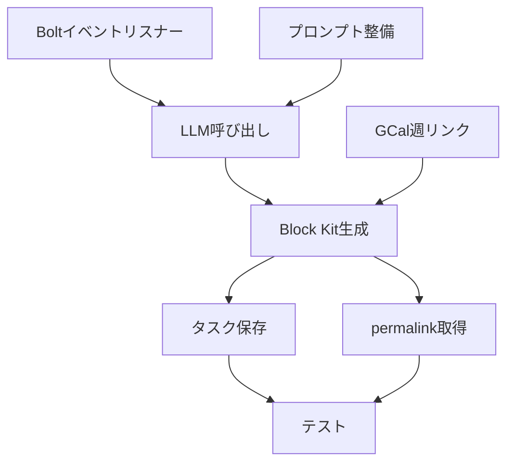

# Quick Reply & Task化 MVP 実装計画

## 実装アーキテクチャ

### ディレクトリ構造
```
src/
├── events/
│   └── messageHandler.ts      # T1: メッセージイベント処理
├── services/
│   ├── llmClassifier.ts       # T2: LLM分類サービス
│   ├── replyGenerator.ts      # T4: エフェメラルUI生成
│   └── taskManager.ts         # T5: タスク登録
├── utils/
│   ├── calendarUtils.ts       # T3: GCal週リンク生成
│   └── slackUtils.ts          # T6: permalink取得
└── prompts/
    └── quickReply.ts          # T7: Few-shotプロンプト

```

## 実装順序と依存関係



## タスク詳細

### T1: Boltイベントリスナー実装
```typescript
// events/messageHandler.ts
app.event('app_mention', async ({ event, client }) => {
  // ユーザーメンション検出
  const messageText = event.text;
  const channelId = event.channel;
  const threadTs = event.thread_ts || event.ts;
  
  // LLM分類呼び出し
  const classification = await llmClassifier.classify(messageText);
  
  // エフェメラル返信生成
  const blocks = await replyGenerator.generate(classification, event);
  
  // エフェメラル送信
  await client.chat.postEphemeral({
    channel: channelId,
    user: event.user,
    blocks,
    thread_ts: threadTs
  });
});
```

### T2: LLM呼び出しラッパー
```typescript
// services/llmClassifier.ts
interface ClassificationResult {
  type: 'scheduling_request' | 'generic_request';
  dates?: Array<{
    date: string;
    part_of_day: 'morning' | 'afternoon' | 'evening';
  }>;
  intent_variants?: {
    agree_polite: string;
    agree_casual: string;
    reject_polite: string;
    reject_casual: string;
  };
}

async classify(messageText: string): Promise<ClassificationResult> {
  const response = await openai.createChatCompletion({
    model: 'gpt-4-turbo-preview',
    messages: [
      { role: 'system', content: CLASSIFICATION_PROMPT },
      { role: 'user', content: messageText }
    ],
    response_format: { type: 'json_object' }
  });
  
  return JSON.parse(response.data.choices[0].message.content);
}
```

### T3: GCal週リンク生成
```typescript
// utils/calendarUtils.ts
export function generateWeekViewUrl(date: string): string {
  const d = new Date(date);
  const year = d.getFullYear();
  const month = d.getMonth() + 1;
  const day = d.getDate();
  
  // 週の開始日（日曜）を計算
  const weekStart = new Date(d);
  weekStart.setDate(d.getDate() - d.getDay());
  
  return `https://calendar.google.com/calendar/u/0/r/week/${year}/${month}/${weekStart.getDate()}`;
}
```

### T4: Block Kit エフェメラル生成
```typescript
// services/replyGenerator.ts
generateSchedulingBlocks(classification: ClassificationResult): Block[] {
  const { dates, intent_variants } = classification;
  const weekUrl = generateWeekViewUrl(dates[0].date);
  
  return [
    {
      type: 'section',
      text: {
        type: 'mrkdwn',
        text: '📩 *日程調整メッセージを検出しました*'
      }
    },
    {
      type: 'section',
      text: {
        type: 'mrkdwn',
        text: `📅 <${weekUrl}|該当週カレンダーを開く>`
      }
    },
    // 返信案sections...
    {
      type: 'actions',
      elements: [
        {
          type: 'button',
          text: { type: 'plain_text', text: 'タスクとして追加' },
          action_id: 'add_task',
          value: JSON.stringify({ message, classification })
        },
        {
          type: 'button',
          text: { type: 'plain_text', text: 'スレッドで返信する' },
          url: permalink // T6で取得
        }
      ]
    }
  ];
}
```

### T5: タスク登録アクション
```typescript
// actions/taskActions.ts
app.action('add_task', async ({ ack, body, client }) => {
  await ack();
  
  const { message, classification } = JSON.parse(body.actions[0].value);
  
  // タスク保存
  const task = await taskManager.create({
    title: extractTitle(message.text),
    slack_permalink: await getPermalink(message),
    due: calculateDueDate(classification),
    metadata: { originalMessage: message }
  });
  
  // 確認メッセージ
  await client.chat.postEphemeral({
    channel: body.channel.id,
    user: body.user.id,
    text: `✅ タスクを登録しました: ${task.title}`
  });
});
```

## エラーハンドリング

1. **LLMタイムアウト**: 5秒でタイムアウト、汎用返信テンプレート表示
2. **permalink取得失敗**: ボタンを非表示、メッセージで案内
3. **DB保存失敗**: リトライ3回、失敗時はエラーメッセージ

## テスト計画（T8）

### 単体テスト
- LLM分類精度（Few-shotサンプル10件）
- 日付抽出精度
- Block Kit生成

### 結合テスト
1. 日程調整メンション → 正しい分類 → カレンダーリンク生成
2. 一般依頼メンション → 4象限返信案表示
3. タスク追加 → DB保存確認 → /todo表示確認

## 実装スケジュール

| Day | タスク | 成果物 |
|-----|--------|--------|
| 1 | T1, T2 | イベントリスナー、LLM基本実装 |
| 2 | T3, T4 | UI生成完成 |
| 3 | T5, T6 | アクション処理完成 |
| 4 | T7, T8 | プロンプト調整、テスト |

## 成功基準達成方法

1. **30秒以内返信**: LLMレスポンス3秒 + UI生成1秒以内
2. **誤爆ゼロ**: 送信ボタンなし、コピー&ペースト方式
3. **タスク追加95%+**: エラーハンドリング強化、リトライ実装