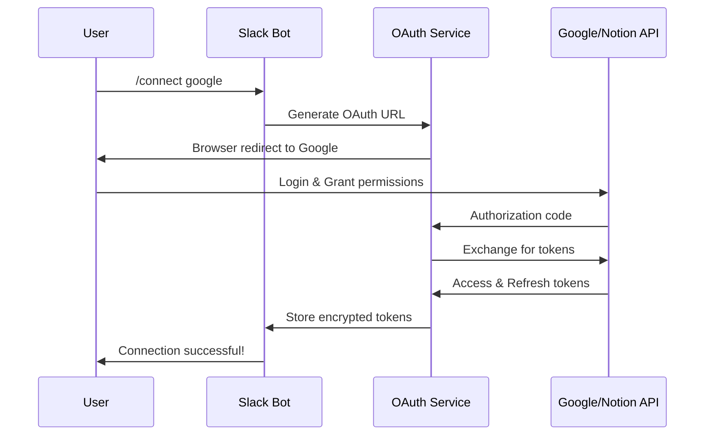

# OAuth Token Management System とは？

**作成日**: 2025-07-25  
**目的**: Task 3 OAuth Token Management System の詳細説明  
**対象**: Slack Personal Assistant プロジェクト

## 🎯 OAuth Token Management System の概要

OAuth Token Management System は、Slack Personal Assistant が外部サービス（Google Calendar、Google Drive、Gmail、Notion、Dropbox等）にアクセスするために必要な **認証トークンを安全に管理するシステム** です。

## 🔑 なぜ必要なのか？

### 現在の制限
- **Bot Token のみ**: 現在はSlack Bot Tokenのみで動作
- **限定的なアクセス**: Slackチャンネル内の情報のみ取得可能
- **外部連携不可**: Google Calendar、Drive、Notion等にアクセスできない

### OAuth実装後の可能性
- **カレンダー統合**: Google Calendarの空き時間確認・予定作成
- **ファイル検索**: Google Drive、Dropboxのファイル検索・要約
- **メール監視**: Gmail の重要メール検出・要約
- **ドキュメント連携**: Notion ページの更新検知・タスク化

## 🏗️ システム構成

### 1. 認証フロー


### 2. トークン管理
```typescript
interface OAuthToken {
  id: string
  provider: 'GOOGLE_CALENDAR' | 'GOOGLE_DRIVE' | 'GMAIL' | 'NOTION' | 'DROPBOX'
  accessToken: string      // 暗号化保存
  refreshToken: string     // 暗号化保存
  expiresAt: DateTime
  scope: string[]
  userId: string
}
```

## 📋 実装内容詳細

### Phase 1: Google OAuth基盤 (8時間)

#### 1.1 Google Calendar OAuth2 flow (3時間)
```typescript
// src/services/oauthService.ts
class OAuthService {
  async initiateGoogleCalendarAuth(userId: string): Promise<string> {
    // OAuth URL生成
    // State parameter でセキュリティ確保
    // Slack内でのブラウザ開封
  }
  
  async handleGoogleCallback(code: string, state: string): Promise<void> {
    // Authorization code → Access/Refresh tokens
    // 暗号化してデータベース保存
    // ユーザーに成功通知
  }
}
```

#### 1.2 Google Drive OAuth2 flow (3時間)
- Calendar と同様のフローをDrive API用に実装
- ファイル検索・要約機能の基盤構築

#### 1.3 Token refresh middleware (2時間)
```typescript
class TokenRefreshMiddleware {
  async ensureValidToken(userId: string, provider: string): Promise<string> {
    // トークン有効期限チェック
    // 期限切れの場合は自動リフレッシュ
    // 失敗時はユーザーに再認証要求
  }
}
```

### Phase 2: セキュリティ強化 (4時間)

#### 2.1 Secrets Manager integration (2時間)
- AWS Secrets Manager または GCP Secret Manager
- 暗号化キーの安全な管理
- 環境変数からの機密情報除去

#### 2.2 Token encryption at rest (2時間)
```typescript
class TokenEncryption {
  encrypt(token: string): string {
    // AES-256-GCM による暗号化
    // ユーザー固有のソルト使用
  }
  
  decrypt(encryptedToken: string): string {
    // 復号化処理
    // 改ざん検知機能
  }
}
```

### Phase 3: 追加プロバイダー (4時間)

#### 3.1 Notion OAuth connection (2時間)
- Notion API v1 OAuth2 実装
- ページ更新検知の基盤

#### 3.2 Browser-based OAuth flow (2時間)
- ユーザーフレンドリーなブラウザ認証
- Slack内でのシームレスな体験

## 🔗 他タスクとの依存関係

### ブロック解除されるタスク
1. **Task 11**: Smart Calendar Integration Core (16h)
   - Google Calendar API アクセスが可能に
   - FreeBusy API、予定作成機能

2. **Task 12**: Gmail Integration (8h)
   - Gmail API アクセスが可能に
   - 重要メール検出・要約機能

3. **Task 13**: Google Drive Integration (10h)
   - Google Drive API アクセスが可能に
   - ファイル検索・コメント監視機能

4. **Task 15**: Notion Integration (8h)
   - Notion API アクセスが可能に
   - ページ更新検知・タスク同期機能

### Claude との連携ポイント
- **User Token オプトイン**: Claude の Phase 3 改善と統合
- **72時間履歴検索**: Slack User Token の管理
- **セキュリティ統一**: 共通の暗号化・エラーハンドリング

## 🎯 ユーザーエクスペリエンス

### 接続フロー
```
1. ユーザー: /connect google
2. Bot: 「Googleアカウントに接続しますか？」
3. ユーザー: [接続する] ボタンクリック
4. ブラウザ: Google認証画面が開く
5. ユーザー: 権限を許可
6. Bot: 「✅ Google Calendar に接続しました！」
7. 機能: カレンダー統合機能が利用可能に
```

### 管理コマンド
- `/connections` - 接続状況確認
- `/disconnect google` - 接続解除
- `/reconnect notion` - 再接続

## 📊 セキュリティ対策

### データ保護
- **暗号化**: AES-256-GCM でトークン暗号化
- **アクセス制御**: ユーザー固有のトークン分離
- **監査ログ**: すべてのトークンアクセスを記録

### プライバシー
- **最小権限**: 必要最小限のOAuthスコープ
- **透明性**: ユーザーに権限内容を明示
- **削除権**: ユーザーによるトークン削除機能

## 🚀 実装後の効果

### 機能拡張
- **カレンダー統合**: 空き時間確認、予定作成
- **ファイル検索**: Drive/Dropbox ファイル要約
- **メール監視**: 重要メール自動検出
- **ドキュメント連携**: Notion 更新通知

### ユーザー価値
- **統合体験**: Slack から全サービスにアクセス
- **自動化**: 手動作業の大幅削減
- **効率化**: 情報収集時間の短縮

## 📋 成功指標

### 技術指標
- **接続成功率**: >95%
- **トークンリフレッシュ成功率**: >99%
- **セキュリティ事故**: 0件

### ユーザー指標
- **接続完了率**: >80%
- **機能利用率**: >60%
- **満足度**: >4.0/5.0

OAuth Token Management System は、Slack Personal Assistant を真の「個人秘書AI」に進化させるための重要な基盤システムです。この実装により、外部サービスとの豊富な連携が可能になり、ユーザーの生産性が大幅に向上します。